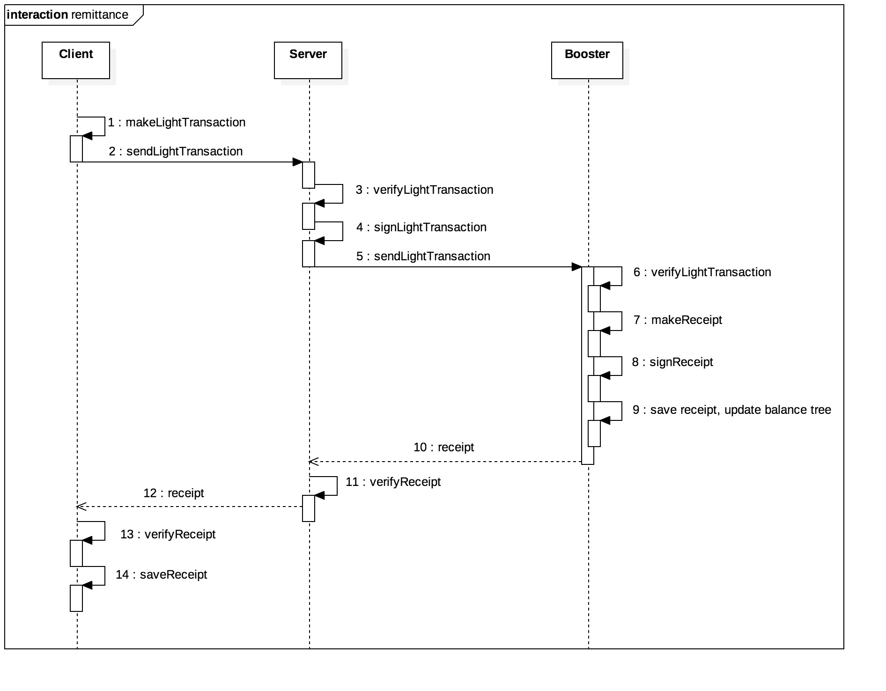
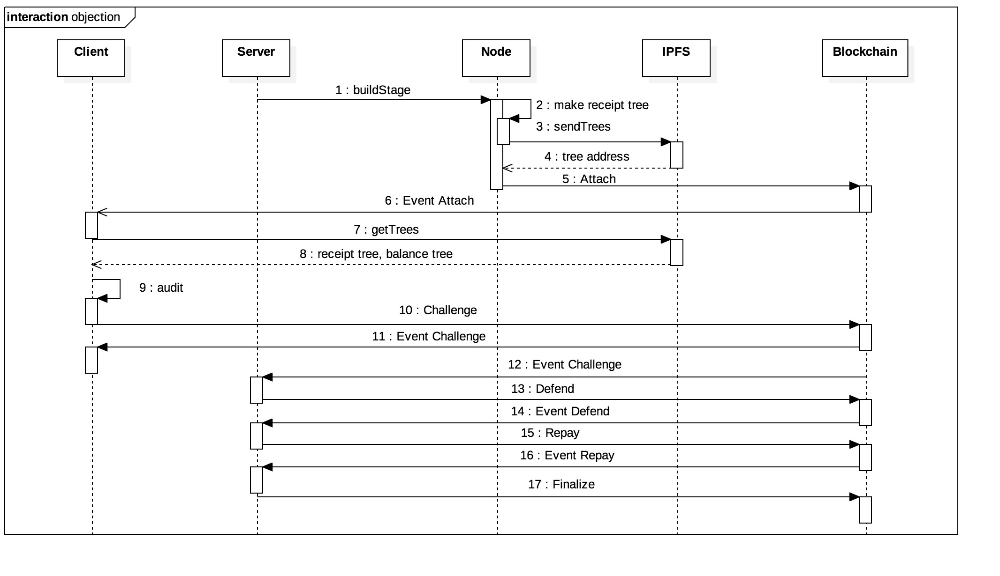

Need overview
分散式稽核
稽核/抗議/自清/確認
透過經濟機制互相制衡
賽局
類似 plasms / truebit / casper
提出詐欺證明 由智能合約進行仲裁
密碼學證據

協定特色
與其他 layer 2 protocol 的不同之處
與中心化服務的整合
存幣
提幣

- 側鏈協定 Protocol
  - 金流側鏈協定（放時序圖）
    - 存幣 Deposit
    - 提幣 Withdraw
    - 轉帳 Remittance
  - 分散式稽核與挑戰期（放時序圖）
    - Off-chain
      - 稽核 Audit
    - On-chain
      - 抗議 Take Objection
      - 自清 Exonerate
      - 罰款 Pay Penalty
      - 確認 Finalize
  - 合約實作

# 協定
## 存幣

### _客戶端_ 向 _區塊鏈_ 申請存幣 (1~2)
客戶端呼叫無窮鏈合約`proposeDeposit`方法
合約新增一筆存幣紀錄 deposit record
[stageHeight, DSN, value, address, timeout, deposited]
例如 Bob(0x123) 存 2 eth
stageHeight: 3
DSN: 1
value: 2
address: 0x123
timeout: 600s
deposited: false

```
[3, 1, 2, 0x123, 600, false]
```

發出`ProposeDeposit`事件
中心化服務監聽

### _中心化服務_ 監聽申請並產生存幣側帳送至 _節點_ (3~5)
中心化服務監聽 `ProposeDeposit` 事件
中心化服務產生存幣側帳並對其簽章
將側帳送至節點
側帳

```
payment: {

}
```

### _節點_ 驗證側帳後產生收據並回傳 _中心化服務_ (6~8)
節點驗證側帳
呼叫 `makeReceipt` 產生收據
更新收據樹及餘額樹

### _中心化服務_ 取得收據並向 _區塊鏈_ 執行存幣 (9~13)
中心化服務取得收據
驗證收據
執行存幣 呼叫 `deposit`

### _客戶端_ 監聽存幣並取得收據 (14~15)

## 提幣 Withdraw

### _客戶端_ 向 _區塊鏈_ 申請提幣 (1~2)
[stageHeight, WSN, value, address, timeout, withdrawed]

### _中心化服務_ 監聽申請並產生提幣側帳送至 _節點_ (3~5)
中心化服務監聽 `proposeWithdrawal` 事件
中心化服務產生提幣側帳並對其簽章
將側帳送至節點

### _節點_ 驗證側帳後產生收據並回傳 _中心化服務_ (6~8)

### _中心化服務_ 取得收據並向 _區塊鏈_ 提交收據 (9~13)
### _客戶端_ 監聽收據提交並取得收據 (14~15)
### _中心化服務_ 新增側鏈區段並經過稽核抗議自清等行為後達成最終性 (16)
挑戰期
提幣必須經過挑戰

### _客戶端_ 於最終性達成後即可向 _區塊鏈_ 執行提幣 (17~18)
呼叫 `withdraw`

## 即時提幣

### _客戶端_ 產生即時提幣側帳並送至 _中心化服務_ (1~2)
### _中心化服務_ 驗證側帳並送至 _節點_ (3~5)
### _節點_ 驗證側帳後產生收據並回傳 _中心化服務_ (6~7)
### _中心化服務_ 取得收據並送至 _客戶端_ (8~9)
### _客戶端_ 取得收據 (10~12)
### _客戶端_ 執行即時提幣 (14~15)

## 轉帳 Remittance

### _客戶端_ 產生轉帳側帳並送至 _中心化服務_ (1~2)
### _中心化服務_ 驗證側帳並送至 _節點_ (3~5)
### _節點_ 驗證側帳後產生收據並回傳 _中心化服務_ (6~7)
### _中心化服務_ 取得收據並送至 _客戶端_ (8~9)
### _客戶端_ 取得收據 (10~12)

## 稽核與抗議 Auditing and objection


### _中心化服務_ 新增側鏈區段 (1~4)
`commitStage`
密碼學證據
receipt tree rootHash
balance tree rootHash

### _客戶端_ 監聽抗議事件新增區段事件，收到事件後可進行稽核 (5~15)
稽核流程

### _客戶端_ 於稽核失敗時可提出抗議 (5~15)
5種抗議流程

### _中心化服務_ 監聽抗議事件，收到抗議後可進行自清 (16)
自清流程

### _中心化服務_ 於自清失敗後須支付罰款 (17)

### _中心化服務_ 於所有抗議皆被處理後可達成側鏈之最終性 (18)

## 合約實作
psudo code
### 抗議
### 自清
### 支付罰金
### 最終化
