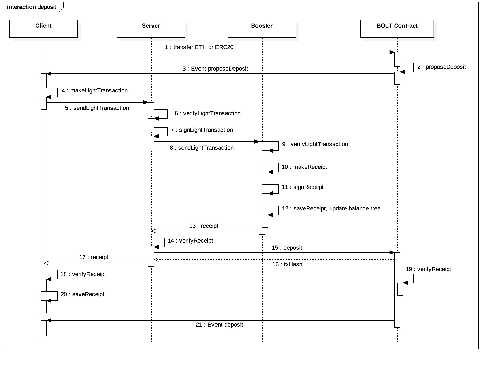
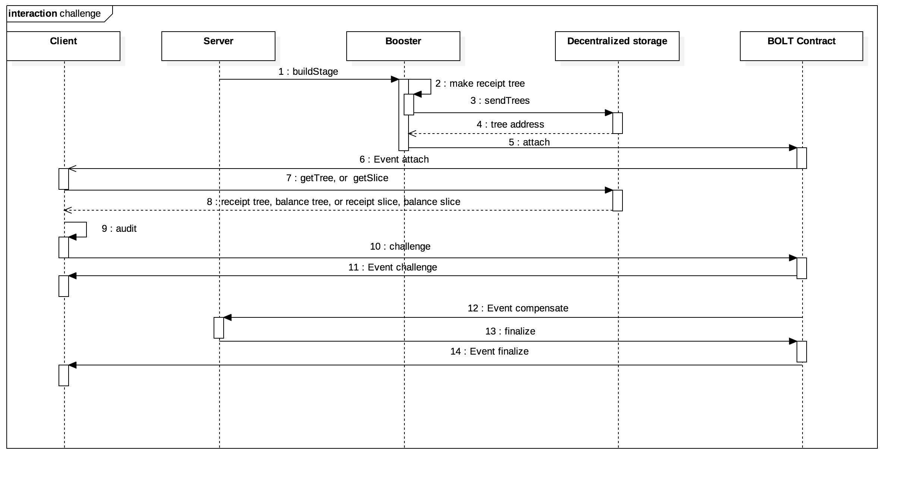

# Infinitechain 金流側鏈白皮書

---

# 大綱 Outline
- 簡介 Introduction
    - 區塊鏈的挑戰
    - 主側鏈架構
- 側鏈 Sidechain
    - 角色 Roles
        - 中心化服務 Central service
        - 客戶端 Client
        - 稽核員 Auditor
        - 去中心化儲存媒體 Decentralized Storage
        - 無窮鏈合約 Infinitechain Contract
    - 資料模型 Data Model
        - 區段 Stage
        - 側帳 Light Transaction
        - 收據 Receipt
        - 索引莫克樹 Indexed Merkle Tree
        - 收據樹 Receipt Tree
        - 餘額樹 Balance Tree
    - 協定 Protocol
        - 存幣 Deposit
        - 提幣 Withdraw
        - 即時提幣 Instant Withdraw
        - 轉帳 Remittance
        - 稽核與抗議 Auditing & Challenge
    - 側鏈的經濟威脅與經濟激勵
        - 經濟威脅：如安全性分析的幾種抗議
        - 經濟激勵：若如實維護側鏈，則可得到利他點數，有利於更高機會取得區塊獎勵
    - 安全性分析
        - 可能遭竄改的資料與攻擊
            - Light Transaction Data
            - GSN
            - Balance
        - 側鏈交易流程分析
            -  Deposit
            -  Withdraw
            -  Remittance
    - 競品分析
        - Raiden Network
        - Plasma
        - Cardano
- 應用 Application
    - 金融服務
    - Streaming Service
    - E-Commerce
# 簡介 Introduction
## 區塊鏈的挑戰
目前區塊鏈的發展遇到相當多的挑戰，包含技術應用、共識機制以及經濟模型上的挑戰．
* 技術應用
    * 交易頻寬過低
      
      現行的公有鏈中(比特幣、以太坊)，TPS約為7-25，一般的應用難以使用，而現在有許多的解決方案像是私有鏈或是中心化的技術，這些做法都犧牲了區塊鏈原來最大的特色:去中心化
    * 手續費太高
      
      由於每一筆上鏈的交易都需要付費給礦工，意即生活上的微支付像是買飲料等等，都需要付出不少的手續費，這對於使用上來說是相當不方便的．
    * 資料膨脹
      
      就算使用私有鏈的做法，強行增加了TPS，整個網路上的每個節點都需要維護這麼大量的數據將會消耗太多儲存資源，會造成節點的高門檻而讓許多人難以成為區塊鏈的一部分
    * 難以跟中心化系統結合
      
      現在的許多的商業應用都是中央式服務，而難以跟區塊鏈做結合，在無窮鏈中，代理人就是在處理中央式服務的角色，非常容易與這些服務介接，同時無窮鏈的分散式稽核機制也讓用戶跟代理人達到資訊對等，讓中心化系統更公平．
* 共識機制
    * 算力集中
      
      現在的礦池過於集中，全球50%的算力集中在不超過5個礦池，造成出塊權利的壟斷，也同時讓這些礦池在區塊鏈的影響力過大．
    * 成本過高
      
      工作量證明的共識方式，需要大量的競爭算力，造成了這些資源的無謂浪費，包含電力以及建構礦機的成本．
* 經濟模型
    * 治理受少數族群壟斷

      許多專案都是由開發團隊制定方向，而無窮鏈提供參數共識的交易，讓用戶不僅可以自訂側鏈參數，在需要大家取得共識時，也可以發起投票．
      
    * ICO詐騙頻繁
      
      在無窮鏈發行ICO，用戶會參考發行者的利他點數來作為了解發行者信用的一種參考，同時在每一期發行者提預算的時候，用戶可以投票決定是否要繼續撥款給這個發行者，或是因為發行者做得不好，便投票把所有剩餘的錢退回給用戶．

## 主側鏈架構
在無窮鏈的主側鏈架構中，主鏈是用做信任機器來維持全球共識,而側鏈則是用做商業邏輯的使用．用戶送出的交易不需每筆都記錄在主鏈上，用戶會送一筆交易給一個代理人並授權讓代理人協助他做紀錄上鏈，代理人會將一段固定時間內的所有授權他的交易產生一個索引莫克樹並將其根雜湊值記錄在主鏈上．
同時，為了確保主側鏈資料一致，無窮鏈使用了分散式稽核機制，允許每個用戶在結算帳本時稽核自己的交易，達到資訊對等，防止代理人出錯；而索引莫克樹的資料結構，也可以讓每個用戶可以快速地取得跟自己相關的資料切片．

# 側鏈 Sidechain
## 角色 Roles
### 中心化服務 Central service
中心化服務是指結合了無窮鏈之伺服器端軟體開發套件(Infinitechain server SDK)，並提供特定服務給客戶端的應用平台。
可能的中心化服務包括了線上直播視訊平台(Live video streaming platform)、電子商務網站(E-commerce website)等。

### 客戶端 Client
客戶端是指結合了無窮鏈之客戶端軟體開發套件(Infinitechain client SDK)，能為客戶提供與中心化服務介接的應用程式。
可能的客戶端包括了網頁瀏覽器(Web browser)、手機應用程式(Moblie app)等。

### 稽核員 Auditor

稽核員是無窮鏈網路中負責維護側鏈安全與穩定的執法者，確保任何側鏈不會因中心化服務之共謀或錯帳，導致客戶端實質上的損失。
稽核員可以是無窮鏈網路上的任意一個節點、客戶甚至是其他中心化服務，意味著任何人都可以對任意一條無窮鏈側鏈進行稽核。

### 去中心化儲存媒體
去中心化儲存媒體是利用無窮鏈節點構成的一種分散式檔案儲存系統，該系統擁有資料不可串改與單點失效不影響資料完整性的特點。
主要用於儲存中心化服務產生的索引莫克樹，並產生對應的訪問地址(Address)，以利稽核員對相應區段(Stage)的索引莫克樹進行稽核。

### 無窮鏈合約
無窮鏈合約是中心化服務啟動側鏈需部署的智能合約，合約內制定了許多啟動側鏈後的規則，保證中心化服務維持側鏈運作，同時保障中心化服務與側鏈參與方的權益。

## 資料模型 Data Model
### 區段 Stage
區段是指側鏈於特定期間內智能合約上的狀態，其內容包含索引莫克樹的根雜湊值roothash，根雜湊值代表一個密碼學證據，是依照儲存在索引莫克樹中一批側帳所產生出的雜湊值，可用來對索引莫克樹中任何一筆側帳做稽核。

### 側帳 Light Transaction
側帳是側鏈不包含買賣雙方交易餘額之交易內容，其中：

    1. lightTxHash : lightTxData 運算產生之雜湊值
    2. type : 側鏈交易型態，可分為deposit, withdraw, remittance, instant withdraw
    3. from : 交易送方之地址
    4. to : 交易收方之地址
    5. value : 交易金額
    6. fee : 手續費
    7. LSN : 全名為 Local Sequence Number，是客戶端每筆交易之亂數編號
    8. stageHeight : 側鏈區段高度
    9. clientLtxSignature : 客戶端對 lightTxHash 簽章之結果
    10. serverLtxSignature : 中心化服務對 lightTxHash 簽章之結果

完整資料格式可分為以下四種:

- Deposit 
- Remittance
- Withdraw
- Instant withdraw

底下是一個`lightTransaction`的JSON格式，我們簡稱為`lightTx`，其中type會根據交易型態而更動，以remittance為例：

```
lightTx = {
    lightTxHash:'6e7f1007bfb89f5af93fb9498fda2e9ca727166cca',
    lightTxData: {
        type: 'remittance',
        from: '0x49aabbbe9141fe7a80804bdf01473e250a3414cb',    
        to: '0x5b9688b5719f608f1cb20fdc59626e717fbeaa9a',
        value: 100,
        fee: 5,
        LSN: 2,
        stageHeight: 1
    },
    sig:{
        clientLtxSignature:{
            v: 28,
            r:'0x384f9cb16fe9333e44b4ea8bba8cb4cb7cf910252e32014397c73aff5f94480c',
            s:'0x55305fc94b234c21d0025a8bce1fc20dbc7a83b48a66abc3cfbfdbc0a28c5709'
        },
        serverLtxSignature:{
            v: 28,
            r:'0x384f9cb16fe9333e44b4ea8bba8cb4cb7cf910252e32014397c73aff5f94480c',
            s:'0x55305fc94b234c21d0025a8bce1fc20dbc7a83b48a66abc3cfbfdbc0a28c5709'
        }
    }
}
```

接下來在`協定`的章節中，light transaction將會以符號表中的`t`為代稱。

### 收據 Receipt
收據為側鏈包含買賣雙方交易餘額之交易內容，其中:

    1. receiptHash : receiptData 運算產生之雜湊值
    2. GSN : 全名為 Global Sequence Number，是側鏈中某階段所有客戶端交易之順序編號
    3. fromBalance : 交易送方之餘額
    4. toBalance : 交易收方之餘額
    5. serverReceiptSignature : 中心化服務對 receiptHash 簽章之結果

完整資料格式可分為以下四種:
- Deposit
- Remittance
- Withdraw
- Instant withdraw

底下是一個`receipt`的JSON格式，其中type會根據交易型態而更動，以remittance為例：

```
receipt = {
    lightTxHash:'6e7f1007bfb89f5af93fb9498fda2e9ca727166ccabd3a7109fa83e9d46d3f1a',
    receiptHash:'73f83ec398e8a4cd2354d1a622426003eeda9b0d0b4999368468dacd08848638',
    lightTxData: {
        type: 'remittance',
        from: '0x49aabbbe9141fe7a80804bdf01473e250a3414cb',    
        to: '0x5b9688b5719f608f1cb20fdc59626e717fbeaa9a',
        value: 100,
        fee: 5,
        LSN: 2,
        stageHeight: 1
    },
    receiptData: {
        GSN: 21,
        lightTxHash:'6e7f1007bfb89f5af93fb9498fda2e9ca727166ccabd3a7109fa83e9d46d3f1a',
        fromBalance: 50,
        toBalance: 500
    },
    
    sig:{
        clientLtxSignature:{
            v: 28,
            r:'0x384f9cb16fe9333e44b4ea8bba8cb4cb7cf910252e32014397c73aff5f94480c',
            s:'0x55305fc94b234c21d0025a8bce1fc20dbc7a83b48a66abc3cfbfdbc0a28c5709'
        },
        serverLtxSignature:{
            v: 28,
            r:'0x384f9cb16fe9333e44b4ea8bba8cb4cb7cf910252e32014397c73aff5f94480c',
            s:'0x55305fc94b234c21d0025a8bce1fc20dbc7a83b48a66abc3cfbfdbc0a28c5709'
        },
        serverReceiptSignature:{
            v: 28,
            r:'0x384f9cb16fe9333e44b4ea8bba8cb4cb7cf910252e32014397c73aff5f94480c',
            s:'0x55305fc94b234c21d0025a8bce1fc20dbc7a83b48a66abc3cfbfdbc0a28c5709'
        }
    }
}
```

接下來在`協定`的章節中，receipt將會以符號表中的`r`為代稱。

### 索引莫克樹 Indexed Merkle Tree

為儲存資料雜湊值的資料結構，特性是可以將大量側帳 建構成一個32bytes的雜湊值，另外可以即時定位索引莫克樹中單一資料雜湊值的位置，以做到即時稽核特定資料的目的。


以上圖為例介紹索引莫克樹，假設今天有一筆資料為Element3，圖片中的索引莫克樹樹高為3，節點編號8到15為葉節點，在索引莫克樹中，我們會使用有索引函式keccak256(Element3)%(葉節點數量)，算出Element3將放到莫克樹中的特定葉節點位置，假設Element3放在節點編號13的位置下，從圖中可以看到編號13的葉節點底下已有Element1及Element2兩筆資料，則Element3會接在後方，當所有Element放在葉節點底下後，節點8到15會依照底下Element的數量算出該節點的雜湊值，如圖中節點編號13的雜湊值是由三個Element由keccak256(Element1+Element2+Element3)運算得出。待葉節點8到15雜湊值運算結束後，節點編號1到7的內節點可以開始計算其雜湊值，例如編號4的節點雜湊值是keccak256('0x888' + '0x999')，依此類推，最後產生出節點編號1的雜湊值我們稱為根雜湊(Root hash)，可以視為索引莫克樹中所有資料的完整性證據，一旦任何放在葉節點的資料作修改，推導出的根雜湊就會不一致。

### 收據樹 Receipt Tree
為索引莫克樹之資料結構，在側鏈協定裡，中心化服務會持續接收客戶端送來的側帳產生對應的收據，將每筆收據儲存起來，並在側鏈新增區段時產生收據樹，把根雜湊值放到智能合約上，以利後續稽核員與客戶端可以和去中心化儲存媒體取得相關之密碼學證據對收據進行驗證。

### 餘額樹 Balance Tree
同樣為索引莫克樹之資料結構，在側鏈協定裡，是中心化服務用來紀錄側鏈中所有客戶端之餘額，當中心化服務收到側帳產生對應之收據同時，會根據每筆收據動態更新餘額樹中客戶端之餘額。

## 協定 Protocol

在描述協定前我們先定義一下常用到的符號：

### 符號表

```
t   : light transaciton
tc  : light transaction  include client signature
ts  : tc include server signature
r   : receipt include ts
rs  : receipt include server signature
LSN : local sequence number
GSN : global sequence number
Si  : stage height i
Ld  : a set of deposit logs in smart contract
Lw  : a set of withdraw logs in smart contract
l   : log in Ld or Lw
Ad  : address of account
Ab  : balance of account
v   : value of assets
Fd  : boolean of deposit flag
Fw  : boolean of withdraw flag
C   : Infinitechain contract
getLatestStageHeight(C) : get the latest stage height in infinitechain contract
getLSN(Ad) : produce the random LSN
type : type of light transaction 
makeLightTx(Si, LSN, Ad, v, 'type') : make light transaction format
signLightTx(t) : sign the light transaction
```

### 存幣


#### _客戶端_ 向 _無窮鏈合約_ 申請存幣 (1~2)
首先， _客戶端_ 向 _無窮鏈合約_ 查詢 `stageHeight` 並計算 `LSN` ，接著產生 `lightTransaction` 並對其簽章：

```
Si   = getLatestStageHeight(C)
LSN  = getLSN(Ad)
t    = makeLightTx(Si, LSN, Ad, v, 'deposit')
tc   = signLightTx(t)
```

接下來， _客戶端_ 呼叫 _無窮鏈合約_ 之 `proposeDeposit` 方法以提出存幣申請，這個方法會在合約新增一筆 `Deposit Log`：

```
Ld'  = *proposeDeposit(tc)
```

其中

```
Ld   = [l1, l2, ...]
Ld'  = push(Ld, l)
l    = [Si, LSN, Ad, v, timeout, Fd]
Fd   = false
```

存幣申請後， _無窮鏈合約_ 即廣播 `ProposeDeposit` 事件，其中包含 `lightTransaction`。

#### _中心化服務_ 監聽申請存幣事件並產生存幣側帳送至 _節點_ (3~5)
之後， _中心化服務_ 監聽 _無窮鏈合約_ 的 `ProposeDeposit` 事件並取得 `lightTransaction`，之後即驗證其客戶端簽章，若驗證成功則 _中心化服務_ 再對其產生簽章並送至 _節點_ ：

```
result = verifyLightTx(tc)

if (result == true) {
  ts = signLightTx(tc)
  r = sendLightTx(ts, NodeURL)
}
```

#### _節點_ 驗證側帳後產生收據並回傳 _中心化服務_ (6~8)
_節點_ 取得 `lightTransaction` 後即驗證其客戶端簽章及中心化服務簽章，若驗證成功則產生 `receipt`，更新 `Balance Tree` 及儲存 `receipt` 於節點資料庫，最後將 `receipt` 回傳 _中心化服務_ ：

```
result = verifyLightTx(ts)

if (result == true) {
  r = makeReceipt(ts)
  updateBalance(r)
  saveReceipt(r)
  return r
}
```

#### _中心化服務_ 取得收據並向 _無窮鏈合約_ 執行存幣 (9~13)
_中心化服務_ 取得 `receipt` 後即對其簽章，接著呼叫合約之 `deposit` 方法以執行存幣：

```
rs = signReceipt(r)
Ld' = *deposit(rs)
```

其中

```
Ld   = [l1, l2, ..., l]
Ld'  = [l1, l2, ..., l']
l'   = [Si, LSN, Ad, v, timeout, Fd']
Fd'  = true
```

存幣執行後， _無窮鏈合約_ 即廣播 `Deposit` 事件，其中包含 `receipt`。

#### _客戶端_ 監聽存幣事件並取得收據 (14~15)
最後， _客戶端_ 監聽 _無窮鏈合約_ `Deposit` 事件以取得 `receipt` 並儲存：

```
saveReceipt(rs)
```

### 提幣 Withdraw


#### _客戶端_ 向 _無窮鏈合約_ 申請提幣 (1~2)
首先， _客戶端_ 向 _無窮鏈合約_ 查詢 `stageHeight` 並計算 `LSN` ，接著產生 `lightTransaction` 並對其簽章：

```
Si   = getLatestStageHeight(C)
LSN  = getLSN(Ad)
t    = makeLightTx(Si, LSN, Ad, v, 'withdraw')
tc   = signLightTx(t)
```

接下來， _客戶端_ 呼叫 _無窮鏈合約_ 之 `proposeWithdraw` 方法以提出提幣申請，這個方法會在合約新增一筆 `Withdraw Log`：

```
Lw'  = *proposeWithdraw(tc)
```

其中

```
Lw   = [l1, l2, ...]
Lw'  = push(Lw, l)
l    = [Si, LSN, Ad, v, timeout, Fw]
Fw   = false
```

提幣申請後， _無窮鏈合約_ 即廣播 `ProposeWithdraw` 事件，其中包含 `lightTransaction`。

#### _中心化服務_ 監聽申請提幣事件並產生提幣側帳送至 _節點_ (3~5)
之後， _中心化服務_ 監聽 _無窮鏈合約_ 的 `ProposeWithdraw` 事件並取得 `lightTransaction`，之後即驗證其客戶端簽章，若驗證成功則 _中心化服務_ 再對其產生簽章並送至 _節點_ ：

```
result = verifyLightTx(tc)

if (result == true) {
  ts = signLightTx(tc)
  r = sendLightTx(ts, NodeURL)
}
```

#### _節點_ 驗證側帳後產生收據並回傳 _中心化服務_ (6~8)
_節點_ 取得 `lightTransaction` 後即驗證其客戶端簽章及中心化服務簽章，若驗證成功則產生 `receipt`，更新 `Balance Tree` 及儲存 `receipt` 於節點資料庫，最後將 `receipt` 回傳 _中心化服務_ ：

```
result = verifyLightTx(ts)

if (result == true) {
  r = makeReceipt(ts)
  updateBalance(r)
  saveReceipt(r)
  return r
}
```

#### _中心化服務_ 取得收據並向 _無窮鏈合約_ 提交收據 (9~13)
_中心化服務_ 取得 `receipt` 後即對其簽章，接著呼叫合約之 `submitReceipt` 方法以提交收據：

```
rs = signReceipt(r)
*submitReceipt(rs)
```

提交收據後， _無窮鏈合約_ 即廣播 `SubmitReceipt` 事件，其中包含 `receipt`。

#### _客戶端_ 監聽收據提交事件並取得收據 (14~15)
最後， _客戶端_ 監聽 _無窮鏈合約_ `SubmitReceipt` 事件以取得 `receipt` 並儲存：

```
saveReceipt(rs)
```

#### _中心化服務_ 新增側鏈區段並達成最終性 (16)
提幣必須經過挑戰期，需經過稽核 / 抗議 / 自清 / 付罰金等流程以達成最終性，其詳細過程會於下一個章節說明。

#### _客戶端_ 向 _無窮鏈合約_ 執行提幣 (17~18)
最後， _客戶端_ 於最終性達成後即可呼叫 _無窮鏈合約_ `withdraw` 方法以執行提幣：

```
Lw' = *withdraw(rs)
```

其中

```
Lw   = [l1, l2, ..., l]
Lw'  = [l1, l2, ..., l']
l'   = [Si, LSN, Ad, v, timeout, Fw']
Fw'  = true
```

### 即時提幣

#### _客戶端_ 產生即時提幣側帳並送至 _中心化服務_ (1~2)
首先， _客戶端_ 向 _無窮鏈合約_ 查詢 `stageHeight` 並計算 `LSN` ，接著產生 `lightTransaction` 並對其簽章：

```
Si   = getLatestStageHeight(C)
LSN  = getLSN(Ad)
t    = makeLightTx(Si, LSN, v, Ad, 'instanctWithdraw')
tc   = signLightTx(t)
r    = sendLightTx(tc, ServerURL)
```

#### _中心化服務_ 驗證側帳並送至 _節點_ (3~5)
_中心化服務_ 取得 `lightTransaction` 後即驗證其客戶端簽章，若驗證成功則對其產生簽章並送至 _節點_ ：

```
result = verifyLightTx(tc)

if (result == true) {
  ts = signLightTx(tc)
  r = sendLightTx(ts, NodeURL)
}
```

#### _節點_ 驗證側帳後產生收據並回傳 _中心化服務_ (6~7)
_節點_ 取得 `lightTransaction` 後即驗證其客戶端簽章及中心化服務簽章，若驗證成功則產生 `receipt`，更新 `Balance Tree` 及儲存 `receipt` 於節點資料庫，最後將 `receipt` 回傳 _中心化服務_ ：

```
result = verifyLightTx(ts)

if (result == true) {
  r = makeReceipt(ts)
  updateBalance(r)
  saveReceipt(r)
  return r
}
```

#### _中心化服務_ 取得收據並送至 _客戶端_ (8~9)
_中心化服務_ 取得 `receipt` 後即對其產生簽章並回傳 _客戶端_ ：

```
rs = signReceipt(r)
return rs
```

#### _客戶端_ 取得收據 (10~12)
接著， _客戶端_ 取得收據後即儲存：

```
saveReceipt(rs)
```

#### _客戶端_ 執行即時提幣 (14~15)
最後， _客戶端_ 呼叫 `instantWithdraw` 方法以執行即時提幣：

```
Lw' = *instantWithdraw(rs)
```

其中

```
Lw   = [l1, l2, ...]
Lw'  = push(Lw, l)
l    = [Si, LSN, Ad, v, timeout, Fw]
Fw   = true
```

### 轉帳 Remittance


#### _客戶端_ 產生轉帳側帳並送至 _中心化服務_ (1~2)
首先， _客戶端_ 向 _無窮鏈合約_ 查詢 `stageHeight` 並計算 `LSN` ，接著產生 `lightTransaction` 並對其簽章：

```
Si   = getLatestStageHeight(C)
LSN  = getLSN(Ad)
t    = makeLightTx(Si, LSN, v, Ad, 'remittance')
tc   = signLightTx(t)
r    = sendLightTx(tc, ServerURL)
```

#### _中心化服務_ 驗證側帳並送至 _節點_ (3~5)
_中心化服務_ 取得 `lightTransaction` 後即驗證其客戶端簽章，若驗證成功則對其產生簽章並送至 _節點_ ：

```
result = verifyLightTx(tc)

if (result == true) {
  ts = signLightTx(tc)
  r = sendLightTx(ts, NodeURL)
}
```

#### _節點_ 驗證側帳後產生收據並回傳 _中心化服務_ (6~7)
_節點_ 取得 `lightTransaction` 後即驗證其客戶端簽章及中心化服務簽章，若驗證成功則產生 `receipt`，更新 `Balance Tree` 及儲存 `receipt` 於節點資料庫，最後將 `receipt` 回傳 _中心化服務_ ：

```
result = verifyLightTx(ts)

if (result == true) {
  r = makeReceipt(ts)
  updateBalance(r)
  saveReceipt(r)
  return r
}
```

#### _中心化服務_ 取得收據並送至 _客戶端_ (8~9)
_中心化服務_ 取得 `receipt` 後即對其產生簽章並回傳 _客戶端_ ：

```
rs = signReceipt(r)
return rs
```

#### _客戶端_ 取得收據 (10~12)
最後， _客戶端_ 取得收據後即儲存：

```
saveReceipt(rs)
```

### 稽核與抗議 Auditing and Challenge



#### _中心化服務_ 新增側鏈區段 (1~4)
`commitStage`
密碼學證據
receipt tree rootHash
balance tree rootHash
完整性證明
tree building
indexed merkle tree

#### _客戶端_ 監聽抗議事件新增區段事件，收到事件後可進行稽核 (5~15)


#### _客戶端_ 於稽核失敗時可提出抗議 (5~15)


#### _中心化服務_ 監聽抗議事件，收到抗議後可進行自清 (16)


#### _中心化服務_ 於自清失敗後須支付罰款 (17)

#### _中心化服務_ 於所有抗議皆被處理後可達成側鏈之最終性 (18)

## 安全性分析

金流側鏈，實質上是一個針對中心化環境設計的協定，可由以下幾點得知

1. 任何用戶在側鏈產生的轉帳，都要經過中心化服務的驗證，才會進一步更改側鏈節點中的收據樹與餘額樹，在此過程，中心化服務都可能透過竄改側鏈節點程式驗證簽章演算法或直接竄改這些轉帳資料
2. 雖然任何側鏈用戶皆可產生交易，但此時此刻決定是否出帳的記帳權，始終在中心化服務身上
3. 正常的存幣、提幣等行為，中心化服務會需要回傳一筆收據給用戶，但中心化服務有控制權決定是否真的要傳送收據
4. 稽核過程所需的Indexed Merkle Tree, Balance Tree等數據結構，中心化服務還是可以控制是否傳送給稽核員核查

因此在整個側鏈的運作中，中心化服務有以上幾個時間點有機會操弄側鏈用戶的交易資料，進一步圖利自身或與中心化服務共謀的用戶。

其中，可能遭竄改的資料內容如以下三處：

1. Light Transaction Data
2. GSN
3. Balance

因此，此節將針對以上幾個時間點和中心化服務可能竄改的資料內容，所產生的攻擊和影響，來分析金流側鏈的安全性。

但在進入正題之前，需要先探討一個重要的側鏈議題，即側鏈相對於主鏈為較中心化的系統，因此會存在**Data Availability**的議題，在前述協定章節中提到，稽核員需要收據樹及餘額樹檢驗各項潛在的攻擊並採取相應的措施，保障側鏈安全，但如果中心化服務不提供收據樹及餘額樹時，將會導致稽核員無法確實稽核，使得側鏈處於不安全的環境下，因此在我們的協定中可以利用去中心化儲存媒體，如IPFS，與智能合約訂下規則，若中心化服務在打包側鏈階段回主鏈時，沒有提供收據樹及餘額樹之IPFS地址，或透過IPFS地址取回之收據樹與餘額樹和登記在智能合約上的完整性資訊不符，則側鏈之參與方可輕易透過智能合約狀態得知此側鏈目前違反**Data Availability**規則，側鏈參與方可直接執行提幣，離開不安全的側鏈，解決了較中心化的環境中**Data Availability**的議題。因此，接下來的安全性分析，將在中心化服務皆能提供收據樹及餘額樹給所有側鏈參與方驗證的前提下進行討論。

### Light Transaction Data

一個完整的側帳包含許多資訊，其中`lightTxData`內含了一個交易送方自願承諾的交易資訊，其中最容易被竄改的資料為交易金額`value`，以下舉例保有竄改機會的中心化服務可能在未經交易送方同意的狀況下，做出以下的行為，試圖以此竄改的結果圖利自身或特定用戶。

假設Bob的地址`0x49aabbbe9141fe7a80804bdf01473e250a3414cb`試圖傳送給Alice，其地址為`0x5b9688b5719f608f1cb20fdc59626e717fbeaa9a`，100個單位的代幣，則Bob可以透過Infinitechain SDK產生如下`lightTxData`資料，計算出`lightTxHash`，並對`lightTxHash`簽章，附加簽章回側帳資訊上。隨後傳送此側帳給中心化服務，等待出帳。

在側鏈節點沒有被中心化服務竄改驗證簽章邏輯的情況下，可能產生以下兩種攻擊：

#### 竄改lightTxData

```
lightTx = {
    lightTxHash:'6e7f1007bfb89f5af93fb9498fda2e9ca727166cca',
    lightTxData: {
        type: 'remittance',
        from: '0x49aabbbe9141fe7a80804bdf01473e250a3414cb',    
        to: '0x5b9688b5719f608f1cb20fdc59626e717fbeaa9a',
        value: 100,
        fee: 5,
        LSN: 2,
        stageHeight: 1
    },
    sig:{
        clientLtxHash:{
            v: 28,
            r:'0x384f9cb16fe9333e44b4ea8bba8cb4cb7cf910252e32014397c73aff5f94480c',
            s:'0x55305fc94b234c21d0025a8bce1fc20dbc7a83b48a66abc3cfbfdbc0a28c5709'
        }
    }
}
```

但今天中心化服務若是懷抱著惡意，試圖竄改交易資料圖利特定用戶，可能會產生以下的錯誤交易：

```
lightTx = {
    lightTxHash:'6e7f1007bfb89f5af93fb9498fda2e9ca727166cca'
    lightTxData: {
        type: 'remittance',
        from: '0x49aabbbe9141fe7a80804bdf01473e250a3414cb', 
        to: '0x5b9688b5719f608f1cb20fdc59626e717fbeaa9a',
        value: 500,
        fee: 10,
        LSN: 2,
        stageHeight: 1
    }
    sig:{
        clientLtxHash:{
            v: 28,
            r:'0x384f9cb16fe9333e44b4ea8bba8cb4cb7cf910252e32014397c73aff5f94480c',
            s:'0x55305fc94b234c21d0025a8bce1fc20dbc7a83b48a66abc3cfbfdbc0a28c5709'
        }
        serverLtxHash:{
            v: 28,
            r:'0x384f9cb16fe9333e44b4ea8bba8cb4cb7cf910252e32014397c73aff5f94480c',
            s:'0x55305fc94b234c21d0025a8bce1fc20dbc7a83b48a66abc3cfbfdbc0a28c5709'
        }
    }
}
```

如以上的結果，`lightTxData`的內容中，`value`從100被改成500，`fee`從5被竄改成10之後，但中心化服務**不重新計算**`lightTxHash`，再將此錯誤的交易資訊傳送給側鏈節點，使側鏈節點更新錯誤的側帳，再此情況中，交易的送方`0x49aabbbe9141fe7a80804bdf01473e250a3414cb`餘額將被多扣除400，而交易的收方`0x5b9688b5719f608f1cb20fdc59626e717fbeaa9a`餘額將多增加400，因此，**側鏈節點在未被竄改**的情況之下，側鏈節點將會重新透過`lightTxData`計算`lightTxHash`後，即可得知遭竄改的`lightTxData`與`lightTxHash`並不吻合，因此將會拒絕此側帳記載在側鏈節點中。

#### 竄改lightTxData與lightTxHash

同上，**側鏈節點在未被竄改**的情況之下，側鏈節點將會重新透過`lightTxData`計算`lightTxHash`後，即可得知遭竄改的`lightTxData`與`lightTxHash`雖吻合，但中心化服務因無法得知交易送方之私鑰，無法偽造Bob對錯誤`lightTxHash`之合法簽章，故交易送方產生的`clientLtxHash`簽章與遭竄改的`lightTxHash`不吻合，因此側鏈節點將會拒絕此側帳。

但側鏈節點本身可能依然是由中心化服務所保持，因此需要考慮中心化服務竄改側鏈節點驗證簽章的可能，使其跳過重新計算`lightTxData`與檢驗`lightTxHash`是否相同等程序，達成將竄改的側帳寫入側鏈節點中。

若發生此情形，可能造成以下幾種攻擊。

#### 竄改lightTxData

錯誤的側帳寫入側鏈節點後，中心化服務需要對收據的`receiptHash`簽章，用戶則會取得錯誤的收據，其結構可能如下：

```
receipt = {
    lightTxHash:'6e7f1007bfb89f5af93fb9498fda2e9ca727166ccabd3a7109fa83e9d46d3f1a',
    receiptHash:'73f83ec398e8a4cd2354d1a622426003eeda9b0d0b4999368468dacd08848638',
    lightTxData: {
        type: 'remittance',
        from: '0x49aabbbe9141fe7a80804bdf01473e250a3414cb',    
        to: '0x5b9688b5719f608f1cb20fdc59626e717fbeaa9a',
        value: 500,
        fee: 10,
        LSN: 2,
        stageHeight: 1
    },
    receiptData: {
        GSN: 21,
        lightTxHash:'6e7f1007bfb89f5af93fb9498fda2e9ca727166ccabd3a7109fa83e9d46d3f1a',
        fromBalance: 50,
        toBalance: 500
    },
    
    sig:{
        clientLtxHash:{
            v: 28,
            r:'0x384f9cb16fe9333e44b4ea8bba8cb4cb7cf910252e32014397c73aff5f94480c',
            s:'0x55305fc94b234c21d0025a8bce1fc20dbc7a83b48a66abc3cfbfdbc0a28c5709'
        },
        serverLtxHash:{
            v: 28,
            r:'0x384234cb16fe9333e44b4ea8bba8cb4cb7cf910252e32014397c73aff5f94480c',
            s:'0x55305fc94b234c21d0025a8bce1fc20dbc7a83b48a66abc3cfbfdbc0a28c5709'
        },
        serverReceiptHash:{
            v: 28,
            r:'0x384f9cb16fe9333e44b4ea8bba8cb4cb7cf910252e32014397c73aff5f94480c',
            s:'0x55305fc94b234c21d0025a8bce1fc20dbc7a83b48a66abc3cfbfdbc0a28c5709'
        }
    }
}
```

用戶收到此錯誤的收據後，會執行前述之稽核演算法流程，檢驗此收據資料的各項完整性與不可否認性。其中，在檢驗`lightTxData`之完整性時，就會發現與`lightTxHash`不同。此後，Bob就可以使用此錯誤之收據向主鏈上管理側鏈的智能合約執行抗議，經過挑戰期後即可取得押金。

#### 竄改lightTxData與lightTxHash

同理，用戶透過稽核演算法，將發現遭竄改的`lightTxData`與重新填入的`lightTxHash`雖吻合，但中心化服務因無法得知交易送方之私鑰，故無法偽造Bob對錯誤`lightTxHash`之合法簽章，故Bob在檢驗自己的簽章是否符合遭竄改的`lightTxHash`時，即會發現簽章不符，因此此收據不會通過稽核演算法之不可否認性檢查，此後，Bob就可以使用此錯誤之收據向主鏈上管理側鏈的智能合約執行抗議，經過挑戰期後即可取得押金。

### GSN

GSN作為管理側帳在某個階段各客戶端交易之順序編號，對側帳合理性的影響為之重大，故也可能遭中心化服務竄改與圖利他人，本節討論各個針對GSN攻擊的可能，與其造成的影響，並說明Infinitechain金流側鏈如何應對此類攻擊。


#### 重複GSN

在側鏈正常運作環境中，一個合理的側帳順序，應與下圖邏輯相同，其中側鏈參與方A, B, C, D, E之間的側帳穿插在側鏈某個階段中，每一筆的側帳都會根據金額，更新相對應的交易雙方餘額，且根據正確GSN的排序每一個側帳的結果都是合理的。


每當中心化服務打包側帳階段回主鏈後，側鏈參與方可於去中心化儲存媒體上取得該側帳階段的收據樹及餘額樹做完整性稽核，但今天某側鏈參與方可能與中心化服務共謀，試圖竄改收據之順序編號導致某個階段有多筆收據含重複的`GSN`，可能會產生以下的有爭議的順序：


如上圖，其中在同一個階段中，GSN為3的側帳被稽核者發現有兩筆，則此情形無法根據GSN為4的側帳推斷出哪個GSN為3的側帳才是合理的，因此此情形被發現後，將會被定位成側鏈的重大違規，稽核員可將此兩筆重複GSN的收據提交給智能合約執行抗議，待智能合約驗證相關中心化服務之簽章、階段與GSN後，待挑戰期結束後，合約將通知側鏈參與方此側鏈已有重大違規發生，其他側鏈參與方觀察到此事件後，即可向智能合約證明上個階段之餘額，接著立即提領上個階段參與方自己的餘額並離開此側鏈。

#### 缺漏GSN

除了重複GSN的可能外，也可能有缺漏GSN的問題，詳細可能的狀況如下圖：


其中，在同個階段中，收據樹中缺漏了GSN為3的收據，可能造成GSN為4之後的餘額不合理，因此，稽核員在透過稽核演算法，依照GSN順序檢驗過程就會發現餘額與轉帳金額不相符，稽核員可以提交給智能合約GSN為2以及GSN為4的收據資料，智能合約根據金額驗算餘額不相符後，就算抗議成功，只要中心化服務無法提出GSN為3的正確收據，使所有收據合理化，等到階段挑戰期過後，中心化服務會因為此次錯帳，將來側鏈參與方B從側鏈轉移資產回主鏈時，由中心化服務放置在智能合約中的押金轉移給參與方B，以示負責，並且，當初提出抗議的稽核員，也能取得稽核獎金，因此，此種錯帳情形下，金流側鏈也能保持錯帳後金流側鏈正常運作，並且有足夠的經濟威脅，防止中心化服務蓄意產生此種不合理的側帳。

### Balance

Balance記載著每位側鏈參與方在同個階段中帳戶的餘額，所有參與方的Balance會記載在餘額樹裡，而同個階段的側鏈參與人不論產生多少次`Remittance`皆不會造成側鏈金額總量的變動，如果中心化服務與參與方共謀，可能會產生以下兩種攻擊:


#### 共謀提幣

假設參與方與中心化服務企圖共謀提領側鏈中的金額，例如ERC20 token或ETH，可能會發生以下攻擊案例。


中心化服務將GSN為3的收據裡參與方E原先的餘額120改為2020並放入收據樹中，接下來參與方E成功提幣，這將導致側鏈金額總量少了2000，在側鏈金額總量變少的情形下，會導致少數側鏈參與方沒辦法正確提幣，如果稽核員在這個階段確實稽核，就會發現這筆Balance被修改的收據金額不對，進而將GSN為2與3的收據提交給智能合約執行抗議，待智能合約驗證相關中心化服務之簽章、階段、GSN與Balance後，讓GSN為3的錯帳中，多給參與方E金額為1900的側帳能透過智能合約的押金3000彌補，使得側鏈能夠正常運行。

#### 超額共謀提幣


與共謀提幣相同，中心化服務將GSN為3的收據裡參與方E原先的餘額120改為200020，此時參與方E的餘額遠大於中心化服務在智能合約中的押金，假設參與方E提幣成功，將會導致側鏈金額總量不足以讓其他側鏈參與方提幣，如果稽核員在這個階段確實稽核，就會發現這筆Balance被修改的收據裡金額不對，進而將GSN為2與3的收據提交給智能合約執行抗議，待智能合約驗證相關中心化服務之簽章、階段、GSN與Balance後，待挑戰期結束後，合約將通知側鏈參與方此側鏈已有重大違規發生，其他側鏈參與方觀察到此事件後，即可向智能合約證明上個階段之餘額，接著立即提領上個階段參與方自己的餘額並離開此側鏈。

## 側鏈交易流程分析
此節會針對三種類型側帳交易的側鏈運行流程做說明，當側鏈參與方在側鏈產生三種不同型態的側帳交易時，中心化服務有可能做到的幾種攻擊手段，底下將一一做剖析。

#### 存幣無回應攻擊


中心化服務在上圖第二步驟監聽到**存幣申請事件**後，若沒有後續幫助Bob在側鏈新增一筆存幣側帳，並增加Bob在側鏈對應地址的餘額，則等到智能合約中depositTimeout時限一到，相同存幣紀錄中的deposited仍為false時，表示中心化服務沒有盡到該盡的責任，則此時Bob可以透過執行智能合約之**depositTimeout**方法，告知合約自己的存幣編號，待智能合約驗證地址與該存幣編號所指的存幣紀錄中，deposited確實為false，則取出該筆存幣紀錄的value，並轉移value個資產回Bob在主鏈的地址，因此，整個過程Bob並不會因為中央式服務關閉或惡意不處理等問題，導致存幣無法取回。

#### 錯誤存幣金額攻擊


若Bob透過智能合約提出存幣申請，數量為100個，但中央式服務在監聽到存幣申請事件後，在側鏈替Bob寫入的存幣金額為錯誤的90個，試圖造成Bob損失，則當中央式服務試圖提交存幣收據給智能合約驗證時，會向合約提出以下資訊，(serverLtxHash=中央式服務針對lightTxHash的簽章, type=deposit, from=此處送方地址為null, to=Bob地址, value=側鏈存幣金額, stageHeight=此側帳將被放置於哪個側鏈階段, LSN=防止雙花攻擊之編號, keccak256(LSN || stageHeight || address)=存幣編號(DSN), serverReceiptHash=中央式服務針對receiptHash的簽章, GSN=單一stage中側帳編號, fromBalance=此處送方帳戶餘額為null, toBalance=Bob側鏈存幣後餘額，lightTxHash=keccak256(lightTxData))，此時，智能合約只需要根據存幣收據中的存幣編號，查詢出Bob在智能合約上的存幣申請，並比較兩者value數值是否相同，lightTxHash=keccak256(type||from||to||value||stageHeight||LSN)，以及receiptHash=keccak256(GSN||fromBalance||toBalance || lightTxHash)，以及檢查lightTxHash和serverLtxHash是否通過簽章驗證與receiptHash和serverReceiptHash是否通過簽章驗證，且兩者皆為服務端地址發送，成功後將更改deposited為true，接著才能廣播出**提交收據事件**，故在此處兩者value並不相同，無法通過智能合約驗證，deposited依然為false，除非中央式服務再提出正確金額的收據，否則待depositTimeout時限一到，Bob就能將此次存幣申請，視同無回應，可直接從合約移轉存幣回自己的地址。

### Withdraw
#### 提幣無回應攻擊


中央式服務在監聽到**提幣申請事件**後，若沒有後續幫助Bob在側鏈新增一筆提幣側帳，並增加Bob在側鏈對應地址的餘額，則等到智能合約中withdrawTimeout時限一到，相同提幣紀錄中的withdrawed仍為false時，表示中央式服務沒有盡到該盡的責任，則此時Bob可以透過執行智能合約之**withdrawTimeout**方法，告知合約自己的提幣編號，待智能合約驗證地址該WSN所指的提幣紀錄中，withdrawed確實為false，則取出該筆提幣紀錄的value，並轉移value個資產回Bob在主鏈的地址，因此，若提幣金額合理，整個過程Bob並不會因為中央式服務關閉或惡意不處理等問題，導致提幣無法執行。

#### 錯誤提幣金額攻擊


若Bob透過智能合約提出提幣申請，數量為100個，但中央式服務在監聽到提幣申請事件後，在側鏈替Bob寫入的提幣金額為錯誤的90個，試圖造成Bob損失，則當中央式服務試圖提交提幣收據給智能合約驗證時，會向合約提出以下資訊，(serverLtxHash=中央式服務針對lightTxHash的簽章, type=withdraw, from=Bob地址, to=此處收方為null, value=側鏈提幣金額, stageHeight=此側帳將被放置於哪個側鏈階段, LSN=防止雙花攻擊之編號, keccak256(LSN || stageHeight || address)=提幣編號(WSN), serverReceiptHash=中央式服務針對receiptHash的簽章, GSN=單一stage中側帳編號, fromBalance=Bob側鏈提幣後餘額, toBalance=此處收方帳戶餘額為null)，此時，智能合約只需要根據提幣收據中的WSN，查詢出Bob在智能合約上的提幣申請，並比較兩者value數值是否相同，接著根據以下公式從收據資訊中計算lightTxHash=keccak256(type||from||to||value||stageHeight||LSN)，以及receiptHash=keccak256(GSN||fromBalance||toBalance || lightTxHash)，以及檢查lightTxHash和serverLtxHash是否通過簽章驗證與receiptHash和serverReceiptHash是否通過簽章驗證，且兩者皆為服務端地址發送，接著才能廣播出**提交收據事件**，故在此處兩者value並不相同，無法通過智能合約驗證，提幣紀錄中的withdrawed依然為false，除非中央式服務再提出正確金額的收據，否則待withdrawTimeout時限一到，Bob就能直接將此次提幣申請，視同無回應，可直接從合約移轉value個資產回自己的主鏈地址。

### Remittance
#### 中心化服務竄改交易


若Bob提出交易申請於側鏈轉移資產到Thief的側鏈地址，數量為50個，但中央式服務在收到交易申請後，在側鏈替Bob寫入的交易金額為錯誤的100個，試圖造成Bob損失，圖利Thief，則中心化服務會在第二步驟竄改交易金額後，於側鏈更新錯誤帳本及餘額，取得錯誤收據後，回傳給Bob，此時Bob收到錯誤收據並於驗證階段時，將會發現該錯誤收據的金額與當時傳給中心化服務並含有Bob簽章的側帳不符，具體內容為(clientLtxHash=Bob對lightTxHash的簽章, serverLtxHash=中央式服務針對lightTxHash的簽章, type=remittance, from=Bob地址, to=Thief地址, value=錯誤金額, stageHeight=此側帳將被放置於哪個側鏈階段, LSN=防止雙花攻擊之編號, serverReceiptHash=中央式服務針對receiptHash的簽章, GSN=單一stage中側帳編號, fromBalance=Bob側鏈更新餘額, toBalance=Thief側鏈更新餘額，lightTxHash=keccak256(lightTxData))，Bob會發現clientLtxHash與serverLtxHash的簽章內容不一致，待中央式服務打包側帳為一個新的階段後，開始挑戰期的流程，Bob即可對這筆錯誤收據提出抗議，即便Bob未發現錯誤收據，稽核員在挑戰期也可以代替Bob驗證這筆錯誤收據並提出抗議，取得賠償金。

#### 側鏈交易無回應


若側鏈參與方和中心化服務提出側鏈交易申請後，中心化服務不回應，則側鏈參與方即可執行提幣的動作，這樣就會回到當時withdraw所述，假設中心化服務還是不回應，待withdrawTimeout時限一到，提幣紀錄中的withdrawed仍為false時，表示中央式服務沒有盡到該盡的責任，則此時Bob可以透過執行智能合約之**withdrawTimeout**方法，告知合約自己的提幣編號，待智能合約驗證地址該WSN所指的提幣紀錄中，withdrawed確實為false，則取出該筆提幣紀錄的value，並轉移value個資產回Bob在主鏈的地址。

## 競品分析
### Payment Channel / Raiden Network
- hub要一直在線，需要高度專業化
- hub若存款不夠，導致無法根據路由完成微支付的問題
- 開關通道產生的主鏈交易，造成潛在網路壅塞問題
- 沒有整合中央式系統，無法方便建立web/app等落地應用
### Plasma
- 當Plasma child chain遭受惡意攻擊時，用戶只能選擇離開側鏈
- 沒有原生與中央式系統整合來設計，企業依然需要聘雇了解區塊鏈運作的工程師
- 只適用於Ethereum
### Cardano
- 側鏈採用PoW，共識耗能，速度慢
- 中心化的側鏈卻使用PoW此類互不信任節點之共識演算法，造成矛盾

# 應用 Application
## 金融服務
在傳統金融服務上，存款戶往往不知道銀行(或是任何金融平台)是否會沒經過授權就動用自己的資產，在無窮鏈的分散式稽核底下，用戶跟平台不會有資訊不對等的問題，而這些帳也都記錄在區塊鏈上，金融平台不可任意篡改紀錄．
所有的交易會在側鏈上產生，繼續維持高速交易的需求．每個金融機構可以根據自己的商業邏輯來建立側鏈，將交易留在自己的資料庫中，同時達到高速以及隱私．
## Streaming Service
在影音服務中，內容提供商往往難以了解終端用戶的收視情形，只能仰賴代理商平台提供的數字，所以最後內容提供商只願意以買斷的方式讓代理商播映．
無窮鏈可以讓每個收視戶稽核自己的付款紀錄，同時讓內容提供商了解結款的情形，並且不需要了解所有人的個資就可以確保交易的完整性，達到資訊對等．
## E-Commerce
電商平台已經是相當完整並成熟的產業之一，現在很多人已經相當習慣使用電商平台來做購買產品；使用無窮鏈的金流側鏈服務即可以快速地使用虛擬貨幣微支付來購買產品，同時也可以讓各個用戶確認自己的帳，這個支付系統即可達到快速、安全、不可篡改．
