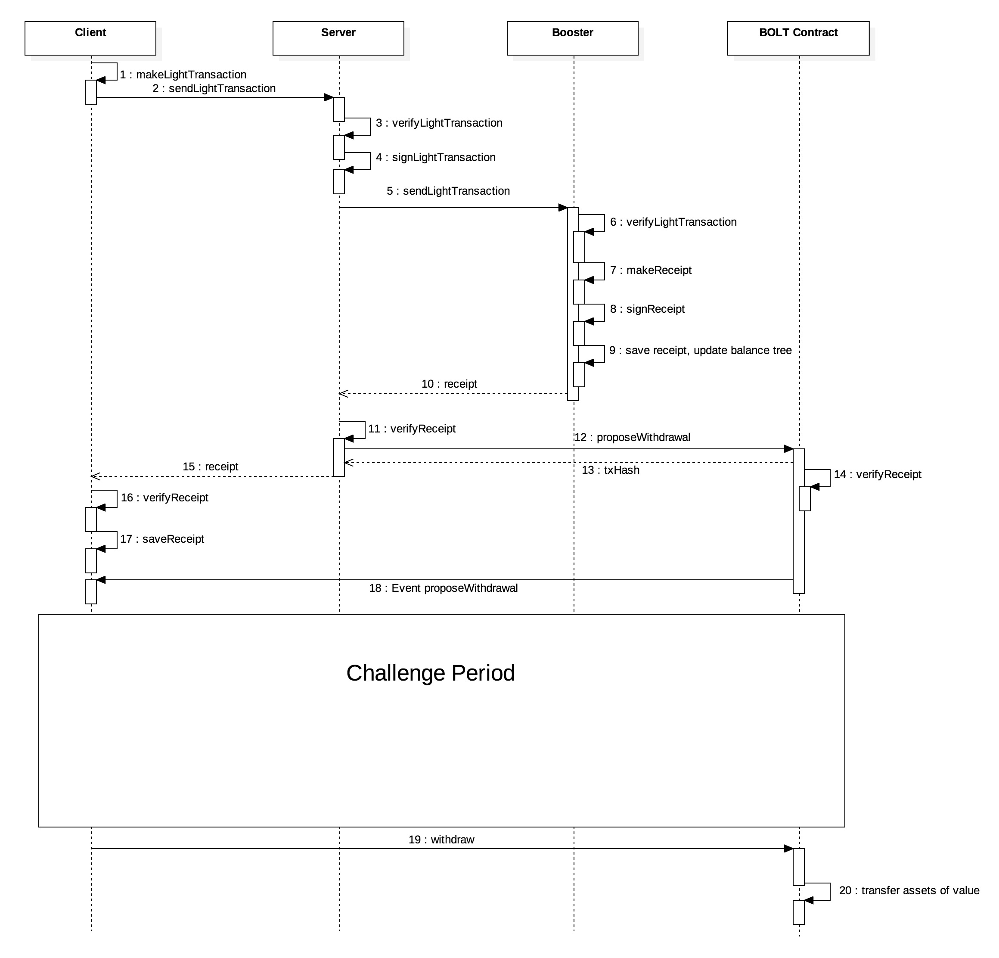
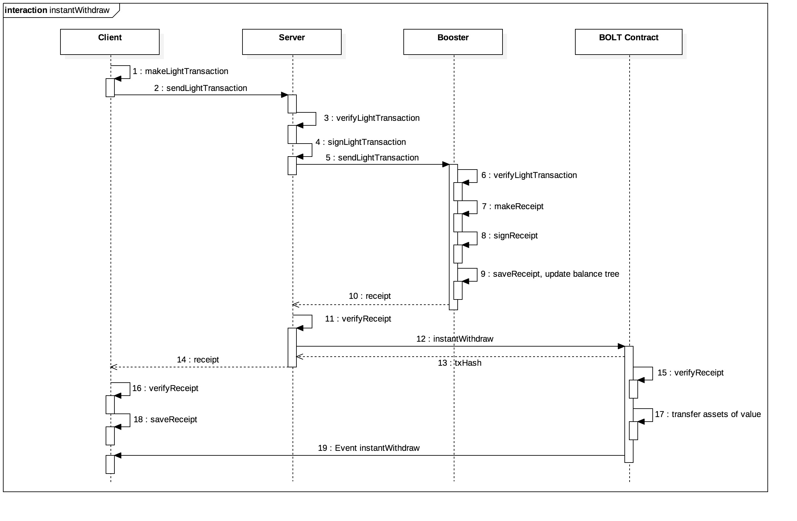
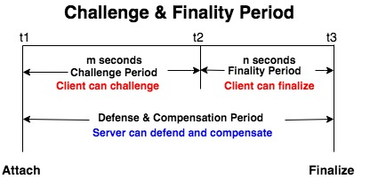
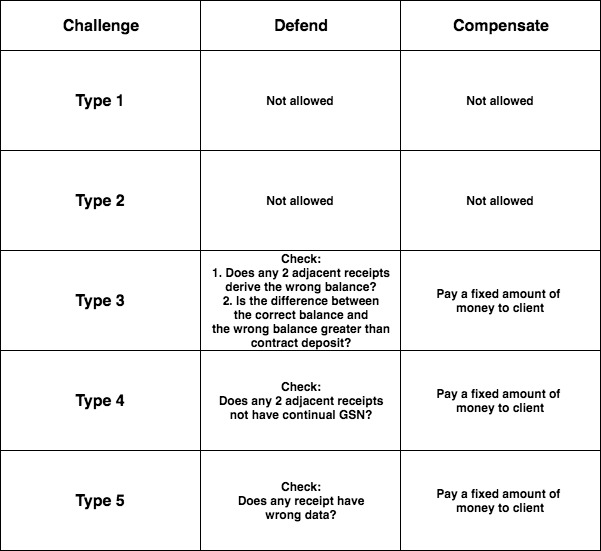

# BOLT: Booster of Ledger Technology
### Yellow Paper

---

# Outline
- Introduction
- Booster
    - Roles
        - Central service
        - Client
        - Auditor
        - Decentralized Storage
        - BOLT Contract
    - Data Model
        - Stage
        - Light Transaction
        - Receipt
        - Indexed Merkle Tree
        - Receipt Tree
        - Balance Tree
    - Protocol
        - Deposit
        - Withdraw
        - Instant Withdraw
        - Remittance
        - Auditing & Challenge
    - Economic penalty
        - Penalty：Each type of fraud will be punished

# Introduction
In Bolt protocol, blockchain mainnet is used for global consensus and booster is used for business logic. A client send a light transaction to the agent and authorized the agent to help him to upload transaction to the blockchain. During a period of time, the agent will compress a bunch of transactions and generate a unique hash and write it on the blockchain. In the meantime, There is a special mechanism called distributed auditing technology for making sure the consistency between the blockchain and the booster. Each user should audit their own transaction after the agent upload the hash value. Thus, it avoids information assymetry and error from the agent. Finally, indexed merkle tree allow each user can obtain his own transaction slices.

# Booster
## Roles
### Central service
Central service indicates the service which developed by the BOLT SDK and provides the specific application to the client. For example, live video streaming platform, e-commerce website.

### Client
Client indicates the client app which developed by the BOLT SDK and an application which can interact with central service. For example, web browser, mobile app.

### Auditor
Auditor is responsible for keep the security and stable of the booster. He makes sure there is no collusion or error transaction in the booster. Auditor could be any node, client or central service in the network. It means anyone can audit any ledgers in the network.

### Decentralized Storage
Decentralized Storage is an decentralized file storing system composed of blockchain full node. The data of this system is immutable and resistance of single point of failure. The purpose of decentralized storage is for storing indexed merkle tree and generate the corresponding address.

### BOLT Contract
BOLT contract is the smart contract which is the requirement of initiating the central service on the blockchain. There define the proctocol and the rule in the contract for operating the correct movement.

## Data Model
### Stage
Stage is the status of the booster at specific time. The content include the root hash of the indexed merkle tree which is the crypto proof of the light transactions during a period of the time.

### Light Transaction

    1. lightTxHash: hash of the lightTxData
    2. from: the address of the sender
    3. to: the address of the receiver
    4. assetID: asset id
    5. value: the value that sender send to receiver
    6. fee: the fee for the agent
    7. nonce: unique random number
    8. logID: DSN / WSN / 0
    9. metadataHash: hash of metadata 
    10. SigClientLightTx : client signature of the light transaction hash
    11. SigServerLightTx : server signature of the light transaction hash
    12. metadata: extra information

There are four type of data format:

- Deposit 
- Remittance
- Withdraw
- Instant withdraw

There is a JSON format of a `lightTransaction`, we called `lightTx`. Take the `remittance` as the example.

```
lightTx = {
    lightTxHash: '6e7f1007bfb89f5af93fb9498fda2e9ca727166cca',
    lightTxData: {
        from: '49aabbbe9141fe7a80804bdf01473e250a3414cb',
        to: '5b9688b5719f608f1cb20fdc59626e717fbeaa9a',
        assetID: 1,
        value: 100,
        fee: 5,
        nonce: '55305fc94b234c21d0025a8bce1fc20dbc7a83b48a66abc3cfbfdbc0a28c5709',
        logID: 0,
        metadataHash: '55305fc94b234c21d0025a8bce1fc20dbc7a83b48a66abc3cfbfdbc0a28c5709'
    },
    sig: {
        clientLightTx: {
            v: 28,
            r: '0x384f9cb16fe9333e44b4ea8bba8cb4cb7cf910252e32014397c73aff5f94480c',
            s: '0x55305fc94b234c21d0025a8bce1fc20dbc7a83b48a66abc3cfbfdbc0a28c5709'
        },
        serverLightTx: {
            v: 28,
            r: '0x384f9cb16fe9333e44b4ea8bba8cb4cb7cf910252e32014397c73aff5f94480c',
            s: '0x55305fc94b234c21d0025a8bce1fc20dbc7a83b48a66abc3cfbfdbc0a28c5709'
        }
    },
    metadata: {
        foo: 'bar'
    }
}
```

Next in the `Protocol` chapter, we will make `t` as the alias of `light transaction`.

### Receipt

    1. receiptHash : the has of receiptData 
    2. stageHeight: stage height
    2. GSN : Global Sequence Number
    3. fromBalance : the balance of the sender
    4. toBalance : the balance of the receiver
    5. SigServerReceipt: server signature of the receipt hash

There are four type of data format:
- Deposit
- Remittance
- Withdraw
- Instant withdraw

There is a JSON format of a `receipt`. Take the `remittance` as the example.

```
receipt = {
    lightTxHash: '6e7f1007bfb89f5af93fb9498fda2e9ca727166ccabd3a7109fa83e9d46d3f1a',
    receiptHash: '73f83ec398e8a4cd2354d1a622426003eeda9b0d0b4999368468dacd08848638',
    lightTxData: {
        from: '49aabbbe9141fe7a80804bdf01473e250a3414cb',
        to: '5b9688b5719f608f1cb20fdc59626e717fbeaa9a',
        assetID: 1,
        value: 100,
        fee: 5,
        nonce: '55305fc94b234c21d0025a8bce1fc20dbc7a83b48a66abc3cfbfdbc0a28c5709',
        logID: 0,
        metadataHash: '55305fc94b234c21d0025a8bce1fc20dbc7a83b48a66abc3cfbfdbc0a28c5709'
    },
    receiptData: {
        stageHeight: 1,
        GSN: 21,
        lightTxHash: '6e7f1007bfb89f5af93fb9498fda2e9ca727166ccabd3a7109fa83e9d46d3f1a',
        fromBalance: 50,
        toBalance: 500
    },
    sig:{
        clientLightTx: {
            v: 28,
            r: '0x384f9cb16fe9333e44b4ea8bba8cb4cb7cf910252e32014397c73aff5f94480c',
            s: '0x55305fc94b234c21d0025a8bce1fc20dbc7a83b48a66abc3cfbfdbc0a28c5709'
        },
        serverLightTx: {
            v: 28,
            r: '0x384f9cb16fe9333e44b4ea8bba8cb4cb7cf910252e32014397c73aff5f94480c',
            s: '0x55305fc94b234c21d0025a8bce1fc20dbc7a83b48a66abc3cfbfdbc0a28c5709'
        },
        serverReceipt: {
            v: 28,
            r: '0x384f9cb16fe9333e44b4ea8bba8cb4cb7cf910252e32014397c73aff5f94480c',
            s: '0x55305fc94b234c21d0025a8bce1fc20dbc7a83b48a66abc3cfbfdbc0a28c5709'
        }
    },
    metadata: {
        foo: 'bar'
    }
}
```

Next in the `Protocol` chapter, we will make `r` as the alias of `receipt`.

### Indexed Merkle Tree

A data structure which stores data hash. It can leverage the hash function to generate a unique root hash. Besides, It can get the position of the specific transaction by modular function in constant time.


Take the above illustration as the example. If there is a transaction names Element3 and node 8 to node 15 are lead nodes. In indexed merkle tree, it uses keccak256(Element3)%(number of leaf node) to calculate the position of Element3. Assume that Element3 is going to put in the node 13. We can see that there are already two data in the node 13, Element1 and Element2. And Element3 will concat behind them. After node 8 to node 15 are finished, then node 4 to node 7 can calculate the hash value. For instance, node 4 is keccak256('0x888' + '0x999'). So on, we can deduce the root hash and we can consider it is the completeness of all the data.

### Receipt Tree
For storing the data structure of the indexed merkle tree. In protocol, central service receive the light transaction and generate the corresponding receipt. Finally, central service will generate a receipt tree for client auditing.

### Account Tree
It is also the indexed merkle tree data structure. In protocol, it used to store the client's information (such like balance). When central service generate the receipt, it also update the information of the client.

## Protocol
### Deposit


#### Client propose deposit (1~3)
First, client send the eth to BOLT contract(or approve the ERC20 to BOLT address), then it will trigger the `*proposeDeposit`. This method will add a `Deposit Log` and broadcast `ProposeDeposit` event which include `DSN`.
```
Ld'  = *proposeDeposit(Ld)
```
which
```
ld   = [DSN, sn_i, ai_a, v, timeout, fd]
fd   = false
Ld   = [ld1, ld2, ...]
Ld'  = push(Ld, ld)
```
#### Client send deposit light transaction (4~5)
Client listen to the `ProposeDeposit` event and get the `DSN`. Then client generate a `lightTransaction` and sign it.

```
sn_i = getLatestStageHeight(I)
LSN  = getLSN(ai_a)
t    = makeLightTx(sn_i, LSN, ai_a, v, 'deposit')
tc   = signLightTx(t)
r    = sendLightTx(tc, ServerURL)
```

#### Central service verify the light transaction (6~8)
Central service get the `lightTransaction` and verify the client's signature. If verification is successful, then send it to the booster.
```
result = verifyLightTx(tc)

if (result == true) {
  ts = signLightTx(tc)
  r = sendLightTx(ts, NodeURL)
}
```
#### Booster generate the receipt (9~12)
After the booster verify the `lightTransaction` which is signed by the client and the server. It will generate the `receipt`, update `Account Set` and store the `receipt` to the database. Finally, sending back the `receipt`.

```
result = verifyLightTx(ts)

if (result == true) {
  r     = makeReceipt(ts)
  A'    = updateAccount(A, r)
  Ri_s' = saveReceipt(Ri_s, r)
  return r
}
```
#### Central service get the receipt (13~16)
After central service get the `receipt` then sign it.
```
rs = signReceipt(r)
```
Then central service call `*deposit` function on the BOLT contract.
```
Ld' = *deposit(rs)
```
which
```
Ld   = [ld1, ld2, ..., ld]
Ld'  = [ld1, ld2, ..., ld']
ld'  = [sn_i, LSN, ai_a, v, timeout, fd']
fd'  = true
```
After central service get the `txHash` then send `receipt` back to the client.
```
return rs
```
After executing the deposit function, BOLT contract broadcast `Deposit` event.
#### Client get the receipt (17~18)
Finally, client store the receipt
```
Ri_c' = saveReceipt(Ri_c, rs)
```
### Withdraw

#### Client propose withdraw (1~2)
First, client generate and sign the `lightTransaction`.
```
sn_i = getLatestStageHeight(I)
LSN  = getLSN(ai_a)
t    = makeLightTx(sn_i, LSN, ai_a, v, 'withdraw')
tc   = signLightTx(t)
r    = sendLightTx(tc, ServerURL)
```
#### central service verify the light transaction (3~5)
Central service verify the signature. If it is successful then sign the `lightTransaction` and send to the booster node.
```
result = verifyLightTx(tc)

if (result == true) {
  ts = signLightTx(tc)
  r = sendLightTx(ts, NodeURL)
}
```
#### Booster node verify the signature (6~9)
Booster node get the `lightTransaction` and verify the signature if it's signed by the client and the central service. If it is successful then generate `receipt`, update `Account Set` and store `receipt`. Finally, send `receipt` back to the central service.
```
result = verifyLightTx(ts)

if (result == true) {
  r     = makeReceipt(ts)
  A'    = updateAccount(A, r)
  Ri_s' = saveReceipt(Ri_s, r)
  return r
}
```
#### Central service get the `receipt` (10~13, 16~17)
```
rs = signReceipt(r)
```
if withdraw value is larger than `v_i`, then central service should call `*proposeWithdrawal`
```
Lw'  = *proposeWithdrawal(Lw)
```
which
```
lw   = [DSN, sn_i, ai_a, v, timeout, fw]
fw   = false
Lw   = [lw1, lw2, ...]
Lw'  = push(Lw, lw)
```
central service get the `txHash` then send back `receipt` to the client
```
return rs
```
After withdraw, BOLT contract broadcast `proposeWithdrawal` event.
#### Client get the receipt (14~15)
```
Ri_c' = saveReceipt(Ri_c, rs)
```
#### Central service attach stage (18)
If withdraw value is larger than `v_i`, then this movement should wait a challenge period (auditing / take objection / exonerate / penalty). 
#### Client withdraw the money (19~20)
Finally, client can call `withdraw` funciton.
```
Lw' = *withdraw(Lw, rs)
```
which
```
Lw  = [lw1, lw2, ..., lw]
Lw' = [lw1, lw2, ..., lw']
lw' = [sn_i, LSN, ai_a, v, timeout, fw']
fw' = true
```
After withdraw function executing, BOLT contract then broadcast `Withdraw` event.
### Instant Withdraw

#### Client generate the withdraw request (1~2)
First, Client generate and sign the `lightTransaction`
```
sn_i = getLatestStageHeight(I)
LSN  = getLSN(ai_a)
t    = makeLightTx(sn_i, LSN, ai_a, v, 'withdraw')
tc   = signLightTx(t)
r    = sendLightTx(tc, ServerURL)
```
#### Central service verify the transactio (3~5)
Central service get the `lightTransaction` and verify the signature. If it is successful then sign and send it to the booster.
```
result = verifyLightTx(tc)

if (result == true) {
  ts = signLightTx(tc)
  r = sendLightTx(ts, NodeURL)
}
```
#### Booster verify the signature(6~9)
Booster node get the `lightTransaction` and verify the signature if it's signed by the client and the central service. If it is successful then generate `receipt`, update `Account Set` and store `receipt`. Finally, send `receipt` back to the central service.
```
result = verifyLightTx(ts)

if (result == true) {
  r     = makeReceipt(ts)
  A'    = updateAccount(A, r)
  Ri_s' = saveReceipt(Ri_s, r)
  return r
}
```
#### Central service get the `receipt` (10~13, 16~17)
```
rs = signReceipt(r)
```
if withdraw value is smaller than `v_i`, then central service should call `*instantWithdraw`
```
Lw'  = *instantWithdraw(Lw)
```
which
```
WSN  = sha3(rs_from, rs_nonce)
lw   = [WSN, sn_i, ai_a, v, timeout, fw]
fw   = false
Lw   = [lw1, lw2, ...]
Lw'  = push(Lw, lw)
```
central service get the `txHash` then send back `receipt` to the client
```
return rs
```
After instant withdraw function executing, BOLT contract then broadcast `instantWithdrawal` event.
#### Client get the receipt (14~15)
```
Ri_c' = saveReceipt(Ri_c, rs)
```
### Remittance

#### Client generate light transaction (1~2)
First, Client check the `stageHeight` from BOLT contract and calculate `LSN`. Using it to generate and sign the `lightTransaction`
```
sn_i = getLatestStageHeight(I)
LSN  = getLSN(ai_a)
t    = makeLightTx(sn_i, LSN, v, ai_a, 'remittance')
tc   = signLightTx(t)
r    = sendLightTx(tc, ServerURL)
```
#### Central service verify the light transaction (3~5)
Central service get the lightTransaction and verify the client's signature. If verification is successful, then send it to the booster.
```
result = verifyLightTx(tc)

if (result == true) {
  ts = signLightTx(tc)
  r = sendLightTx(ts, NodeURL)
}
```
#### Booster generate the receipt (6~7)
After the booster verify the lightTransaction which is signed by the client and the server. It will generate the receipt, update Account Set and store the receipt to the database. Finally, sending back the receipt.
```
result = verifyLightTx(ts)

if (result == true) {
  r     = makeReceipt(ts)
  B'    = updateBalance(B, r)
  Ri_s' = saveReceipt(Ri_s, r)
  return r
}
```
#### Central service get the receipt (8~9)
After central service get the receipt then sign it.
```
rs = signReceipt(r)
return rs
```
#### Client get the receipt (10~12)
Finally, client store the receipt
```
Ri_c' = saveReceipt(Ri_c, rs)
```
### Distributed Auditing

The above sequence diagram illustrate the client takes objection and central service exonerates fail.


It includes `attach`,`audit`,`challenge`,`defend`,`compensate` and `finalize`.

After `attach`, the client, central service and auditor can using different function to make the booster's correctness.

#### Central service attach new stage (1~4)
First, central service call `getRootHash` to get `receipt rootHash` and `balance rootHash`
```
[Ri_h, Bi_h] = getRootHash(Ri)
```
Then, central service call `*attach` to add new `stage`
```
S'  = *attach(S, Ri_h, Bi_h)
si  = [Ri_h, Bi_h, n, fn, Lc, Lw, Ld]
S   = [s1, s2, s3, ...]
S'  = [s1, s2, s3, ..., si]

*Attach(Ri_h)
```
#### Client audit his transaction and take objection (5~15)


Client listen to `Attach` event and execute `audit`, There are 5 scenario will make auditing fail. The client can `challenge` the error scenario during challenge period.

The challenge illustration as follow



```
Ri.each {
  result = audit(rm, rn)
  if ((result != ture) && *isInChallengePeriod(sl)) {
    Lc' = *challenge(Lc, rm, rn, result)
  }
}

Lc = [lc1, lc2, ...]
lc = [rn, ai_a, fc, fp, 'type1']
Lc' = push(Lc, lc)

*Challenge(sn_i, GSN, ai_a)
```

#### Central service exonerates (16)


Central service listen `Challenge` event and execute `defend` for irrational `challenge`

```
Lc' = *defend(Lc, rm, rn)
Lc' = [lc1, lc2, ..., lc']
lc' = [rn, ai_a, fc', fp, 'type1']
```

which

```
if (*audit(rm, rn)) {
  fc' = ture
}
```

#### Central service pay the penalty (17)

If central service execute `defend` unsuccessfully, then it should pay the penalty.

```
Lc' = *compensate(Lc, lc)
Lc' = [lc1, lc2, ..., lc']
lc' = [rn, ai_a, fc, fp', 'type1']
```

which

```
if (*transfer(p)) {
  fp' = true
}
```

#### Finality (18)
Finally, central service handle all the `challenge` and wait until challenge period finish then execute `finalize`.

```
s' = *finalize(s)
s' = [Ri_h, Bi_h, n, fn', Lc, Lw, Ld]
```

which

```
if (*isSettled(sl) && !*isInChallengePeriod(s)) {
  fn' = true
}
```