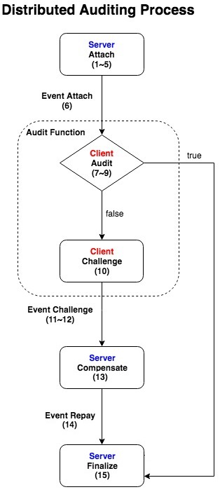
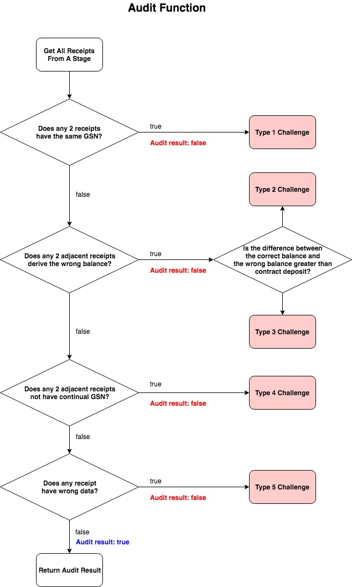

# BOLT: Booster of Ledger Technology
### Yellow Paper

---

# Outline
- Introduction
- Booster
    - Roles
        - Central service
        - Client
        - Auditor
        - Decentralized Storage
        - BOLT Contract
    - Data Model
        - Stage
        - Light Transaction
        - Receipt
        - Indexed Merkle Tree
        - Receipt Tree
        - Balance Tree
    - Protocol
        - Deposit
        - Withdraw
        - Instant Withdraw
        - Remittance
        - Auditing & Challenge
    - Economic penalty
        - Penalty：Each type of fraud will be punished
    - Security Analysis
        - Potential Attacking (abnormal data modified)
            - Light Transaction Data
            - GSN
            - Balance
        - Light Transaction Flow Analysis
            -  Deposit
            -  Withdraw
            -  Remittance
    - Competition Analysis
        - Raiden Network
        - Plasma
        - Cardano
- Application
    - Financial
    - Streaming Service
    - E-Commerce
# Introduction
In Bolt protocol, blockchain mainnet is used for global consensus and booster is used for business logic. A client send a light transaction to the agent and authorized the agent to help him to upload transaction to the blockchain. During a period of time, the agent will compress a bunch of transactions and generate a unique hash and write it on the blockchain. In the meantime, There is a special mechanism called distributed auditing technology for making sure the consistency between the blockchain and the booster. Each user should audit their own transaction after the agent upload the hash value. Thus, it avoids information assymetry and error from the agent. Finally, indexed merkle tree allow each user can obtain his own transaction slices.

# Booster
## Roles
### Central service
Central service indicates the service which developed by the BOLT SDK and provides the specific application to the client. For example, live video streaming platform, e-commerce website.

### Client
Client indicates the client app which developed by the BOLT SDK and an application which can interact with central service. For example, web browser, mobile app.

### Auditor
Auditor is responsible for keep the security and stable of the booster. He makes sure there is no collusion or error transaction in the booster. Auditor could be any node, client or central service in the network. It means anyone can audit any ledgers in the network.

### Decentralized Storage
Decentralized Storage is an decentralized file storing system composed of blockchain full node. The data of this system is immutable and resistance of single point of failure. The purpose of decentralized storage is for storing indexed merkle tree and generate the corresponding address.

### BOLT Contract
BOLT contract is the smart contract which is the requirement of initiating the central service on the blockchain. There define the proctocol and the rule in the contract for operating the correct movement.

## Data Model
### Stage
Stage is the status of the booster at specific time. The content include the root hash of the indexed merkle tree which is the crypto proof of the light transactions during a period of the time.

### Light Transaction

    1. lightTxHash: hash of the lightTxData
    2. from: the address of the sender
    3. to: the address of the receiver
    4. assetID: asset id
    5. value: the value that sender send to receiver
    6. fee: the fee for the agent
    7. nonce: unique random number
    8. logID: DSN / WSN / 0
    9. metadataHash: hash of metadata 
    10. SigClientLightTx : client signature of the light transaction hash
    11. SigServerLightTx : server signature of the light transaction hash
    12. metadata: extra information

There are four type of data format:

- Deposit 
- Remittance
- Withdraw
- Instant withdraw

There is a JSON format of a `lightTransaction`, we called `lightTx`. Take the `remittance` as the example.

```
lightTx = {
    lightTxHash: '6e7f1007bfb89f5af93fb9498fda2e9ca727166cca',
    lightTxData: {
        from: '49aabbbe9141fe7a80804bdf01473e250a3414cb',
        to: '5b9688b5719f608f1cb20fdc59626e717fbeaa9a',
        assetID: 1,
        value: 100,
        fee: 5,
        nonce: '55305fc94b234c21d0025a8bce1fc20dbc7a83b48a66abc3cfbfdbc0a28c5709',
        logID: 0,
        metadataHash: '55305fc94b234c21d0025a8bce1fc20dbc7a83b48a66abc3cfbfdbc0a28c5709'
    },
    sig: {
        clientLightTx: {
            v: 28,
            r: '0x384f9cb16fe9333e44b4ea8bba8cb4cb7cf910252e32014397c73aff5f94480c',
            s: '0x55305fc94b234c21d0025a8bce1fc20dbc7a83b48a66abc3cfbfdbc0a28c5709'
        },
        serverLightTx: {
            v: 28,
            r: '0x384f9cb16fe9333e44b4ea8bba8cb4cb7cf910252e32014397c73aff5f94480c',
            s: '0x55305fc94b234c21d0025a8bce1fc20dbc7a83b48a66abc3cfbfdbc0a28c5709'
        }
    },
    metadata: {
        foo: 'bar'
    }
}
```

Next in the `Protocol` chapter, we will make `t` as the alias of `light transaction`.

### Receipt

    1. receiptHash : the has of receiptData 
    2. stageHeight: stage height
    2. GSN : Global Sequence Number
    3. fromBalance : the balance of the sender
    4. toBalance : the balance of the receiver
    5. SigServerReceipt: server signature of the receipt hash

There are four type of data format:
- Deposit
- Remittance
- Withdraw
- Instant withdraw

There is a JSON format of a `receipt`. Take the `remittance` as the example.

```
receipt = {
    lightTxHash: '6e7f1007bfb89f5af93fb9498fda2e9ca727166ccabd3a7109fa83e9d46d3f1a',
    receiptHash: '73f83ec398e8a4cd2354d1a622426003eeda9b0d0b4999368468dacd08848638',
    lightTxData: {
        from: '49aabbbe9141fe7a80804bdf01473e250a3414cb',
        to: '5b9688b5719f608f1cb20fdc59626e717fbeaa9a',
        assetID: 1,
        value: 100,
        fee: 5,
        nonce: '55305fc94b234c21d0025a8bce1fc20dbc7a83b48a66abc3cfbfdbc0a28c5709',
        logID: 0,
        metadataHash: '55305fc94b234c21d0025a8bce1fc20dbc7a83b48a66abc3cfbfdbc0a28c5709'
    },
    receiptData: {
        stageHeight: 1,
        GSN: 21,
        lightTxHash: '6e7f1007bfb89f5af93fb9498fda2e9ca727166ccabd3a7109fa83e9d46d3f1a',
        fromBalance: 50,
        toBalance: 500
    },
    sig:{
        clientLightTx: {
            v: 28,
            r: '0x384f9cb16fe9333e44b4ea8bba8cb4cb7cf910252e32014397c73aff5f94480c',
            s: '0x55305fc94b234c21d0025a8bce1fc20dbc7a83b48a66abc3cfbfdbc0a28c5709'
        },
        serverLightTx: {
            v: 28,
            r: '0x384f9cb16fe9333e44b4ea8bba8cb4cb7cf910252e32014397c73aff5f94480c',
            s: '0x55305fc94b234c21d0025a8bce1fc20dbc7a83b48a66abc3cfbfdbc0a28c5709'
        },
        serverReceipt: {
            v: 28,
            r: '0x384f9cb16fe9333e44b4ea8bba8cb4cb7cf910252e32014397c73aff5f94480c',
            s: '0x55305fc94b234c21d0025a8bce1fc20dbc7a83b48a66abc3cfbfdbc0a28c5709'
        }
    },
    metadata: {
        foo: 'bar'
    }
}
```

Next in the `Protocol` chapter, we will make `r` as the alias of `receipt`.

### Indexed Merkle Tree

A data structure which stores data hash. It can leverage the hash function to generate a unique root hash. Besides, It can get the position of the specific transaction by modular function in constant time.


Take the above illustration as the example. If there is a transaction names Element3 and node 8 to node 15 are lead nodes. In indexed merkle tree, it uses keccak256(Element3)%(number of leaf node) to calculate the position of Element3. Assume that Element3 is going to put in the node 13. We can see that there are already two data in the node 13, Element1 and Element2. And Element3 will concat behind them. After node 8 to node 15 are finished, then node 4 to node 7 can calculate the hash value. For instance, node 4 is keccak256('0x888' + '0x999'). So on, we can deduce the root hash and we can consider it is the completeness of all the data.

### Receipt Tree
For storing the data structure of the indexed merkle tree. In protocol, central service receive the light transaction and generate the corresponding receipt. Finally, central service will generate a receipt tree for client auditing.

### Account Tree
It is also the indexed merkle tree data structure. In protocol, it used to store the client's information (such like balance). When central service generate the receipt, it also update the information of the client.

## Protocol
### Deposit


#### Client propose deposit (1~3)
First, client send the eth to BOLT contract(or approve the ERC20 to BOLT address), then it will trigger the `*proposeDeposit`. This method will add a `Deposit Log` and broadcast `ProposeDeposit` event which include `DSN`.
```
Ld'  = *proposeDeposit(Ld)
```
which
```
ld   = [DSN, sn_i, ai_a, v, timeout, fd]
fd   = false
Ld   = [ld1, ld2, ...]
Ld'  = push(Ld, ld)
```
#### Client send deposit light transaction (4~5)
Client listen to the `ProposeDeposit` event and get the `DSN`. Then client generate a `lightTransaction` and sign it.

```
sn_i = getLatestStageHeight(I)
LSN  = getLSN(ai_a)
t    = makeLightTx(sn_i, LSN, ai_a, v, 'deposit')
tc   = signLightTx(t)
r    = sendLightTx(tc, ServerURL)
```

#### Central service verify the light transaction (6~8)
Central service get the `lightTransaction` and verify the client's signature. If verification is successful, then send it to the booster.
```
result = verifyLightTx(tc)

if (result == true) {
  ts = signLightTx(tc)
  r = sendLightTx(ts, NodeURL)
}
```
#### Booster generate the receipt (9~12)
After the booster verify the `lightTransaction` which is signed by the client and the server. It will generate the `receipt`, update `Account Set` and store the `receipt` to the database. Finally, sending back the `receipt`.

```
result = verifyLightTx(ts)

if (result == true) {
  r     = makeReceipt(ts)
  A'    = updateAccount(A, r)
  Ri_s' = saveReceipt(Ri_s, r)
  return r
}
```
#### Central service get the receipt (13~16)
After central service get the `receipt` then sign it.
```
rs = signReceipt(r)
```
Then central service call `*deposit` function on the BOLT contract.
```
Ld' = *deposit(rs)
```
which
```
Ld   = [ld1, ld2, ..., ld]
Ld'  = [ld1, ld2, ..., ld']
ld'  = [sn_i, LSN, ai_a, v, timeout, fd']
fd'  = true
```
After central service get the `txHash` then send `receipt` back to the client.
```
return rs
```
After executing the deposit function, BOLT contract broadcast `Deposit` event.
#### Client get the receipt (17~18)
Finally, client store the receipt
```
Ri_c' = saveReceipt(Ri_c, rs)
```
### Withdraw

#### Client propose withdraw (1~2)
First, client generate and sign the `lightTransaction`.
```
sn_i = getLatestStageHeight(I)
LSN  = getLSN(ai_a)
t    = makeLightTx(sn_i, LSN, ai_a, v, 'withdraw')
tc   = signLightTx(t)
r    = sendLightTx(tc, ServerURL)
```
#### central service verify the light transaction (3~5)
Central service verify the signature. If it is successful then sign the `lightTransaction` and send to the booster node.
```
result = verifyLightTx(tc)

if (result == true) {
  ts = signLightTx(tc)
  r = sendLightTx(ts, NodeURL)
}
```
#### Booster node verify the signature (6~9)
Booster node get the `lightTransaction` and verify the signature if it's signed by the client and the central service. If it is successful then generate `receipt`, update `Account Set` and store `receipt`. Finally, send `receipt` back to the central service.
```
result = verifyLightTx(ts)

if (result == true) {
  r     = makeReceipt(ts)
  A'    = updateAccount(A, r)
  Ri_s' = saveReceipt(Ri_s, r)
  return r
}
```
#### Central service get the `receipt` (10~13, 16~17)
```
rs = signReceipt(r)
```
if withdraw value is larger than `v_i`, then central service should call `*proposeWithdrawal`
```
Lw'  = *proposeWithdrawal(Lw)
```
which
```
lw   = [DSN, sn_i, ai_a, v, timeout, fw]
fw   = false
Lw   = [lw1, lw2, ...]
Lw'  = push(Lw, lw)
```
central service get the `txHash` then send back `receipt` to the client
```
return rs
```
After withdraw, BOLT contract broadcast `proposeWithdrawal` event.
#### Client get the receipt (14~15)
```
Ri_c' = saveReceipt(Ri_c, rs)
```
#### Central service attach stage (18)
If withdraw value is larger than `v_i`, then this movement should wait a challenge period (auditing / take objection / exonerate / penalty). 
#### Client withdraw the money (19~20)
Finally, client can call `withdraw` funciton.
```
Lw' = *withdraw(Lw, rs)
```
which
```
Lw  = [lw1, lw2, ..., lw]
Lw' = [lw1, lw2, ..., lw']
lw' = [sn_i, LSN, ai_a, v, timeout, fw']
fw' = true
```
After withdraw function executing, BOLT contract then broadcast `Withdraw` event.
### Instant Withdraw

#### Client generate the withdraw request (1~2)
First, Client generate and sign the `lightTransaction`
```
sn_i = getLatestStageHeight(I)
LSN  = getLSN(ai_a)
t    = makeLightTx(sn_i, LSN, ai_a, v, 'withdraw')
tc   = signLightTx(t)
r    = sendLightTx(tc, ServerURL)
```
#### Central service verify the transactio (3~5)
Central service get the `lightTransaction` and verify the signature. If it is successful then sign and send it to the booster.
```
result = verifyLightTx(tc)

if (result == true) {
  ts = signLightTx(tc)
  r = sendLightTx(ts, NodeURL)
}
```
#### Booster verify the signature(6~9)
Booster node get the `lightTransaction` and verify the signature if it's signed by the client and the central service. If it is successful then generate `receipt`, update `Account Set` and store `receipt`. Finally, send `receipt` back to the central service.
```
result = verifyLightTx(ts)

if (result == true) {
  r     = makeReceipt(ts)
  A'    = updateAccount(A, r)
  Ri_s' = saveReceipt(Ri_s, r)
  return r
}
```
#### Central service get the `receipt` (10~13, 16~17)
```
rs = signReceipt(r)
```
if withdraw value is smaller than `v_i`, then central service should call `*instantWithdraw`
```
Lw'  = *instantWithdraw(Lw)
```
which
```
WSN  = sha3(rs_from, rs_nonce)
lw   = [WSN, sn_i, ai_a, v, timeout, fw]
fw   = false
Lw   = [lw1, lw2, ...]
Lw'  = push(Lw, lw)
```
central service get the `txHash` then send back `receipt` to the client
```
return rs
```
After instant withdraw function executing, BOLT contract then broadcast `instantWithdrawal` event.
#### Client get the receipt (14~15)
```
Ri_c' = saveReceipt(Ri_c, rs)
```
### Remittance

#### Client generate light transaction (1~2)
First, Client check the `stageHeight` from BOLT contract and calculate `LSN`. Using it to generate and sign the `lightTransaction`
```
sn_i = getLatestStageHeight(I)
LSN  = getLSN(ai_a)
t    = makeLightTx(sn_i, LSN, v, ai_a, 'remittance')
tc   = signLightTx(t)
r    = sendLightTx(tc, ServerURL)
```
#### Central service verify the light transaction (3~5)
Central service get the lightTransaction and verify the client's signature. If verification is successful, then send it to the booster.
```
result = verifyLightTx(tc)

if (result == true) {
  ts = signLightTx(tc)
  r = sendLightTx(ts, NodeURL)
}
```
#### Booster generate the receipt (6~7)
After the booster verify the lightTransaction which is signed by the client and the server. It will generate the receipt, update Account Set and store the receipt to the database. Finally, sending back the receipt.
```
result = verifyLightTx(ts)

if (result == true) {
  r     = makeReceipt(ts)
  B'    = updateBalance(B, r)
  Ri_s' = saveReceipt(Ri_s, r)
  return r
}
```
#### Central service get the receipt (8~9)
After central service get the receipt then sign it.
```
rs = signReceipt(r)
return rs
```
#### Client get the receipt (10~12)
Finally, client store the receipt
```
Ri_c' = saveReceipt(Ri_c, rs)
```
### Distributed Auditing

The above sequence diagram illustrate the client takes objection and central service exonerates fail.


It includes `attach`,`audit`,`challenge`,`defend`,`compensate` and `finalize`.

After `attach`, the client, central service and auditor can using different function to make the booster's correctness.

#### Central service attach new stage (1~4)
First, central service call `getRootHash` to get `receipt rootHash` and `balance rootHash`
```
[Ri_h, Bi_h] = getRootHash(Ri)
```
Then, central service call `*attach` to add new `stage`
```
S'  = *attach(S, Ri_h, Bi_h)
si  = [Ri_h, Bi_h, n, fn, Lc, Lw, Ld]
S   = [s1, s2, s3, ...]
S'  = [s1, s2, s3, ..., si]

*Attach(Ri_h)
```
#### 客戶端進行稽核，稽核失敗則提出抗議 (5~15)


客戶端監聽 `Attach` 事件後即開始執行 `audit`，詳細稽核方法如上圖所示，有5種情形會導致稽核失敗，而客戶端可以在**挑戰期**內為每一種失敗情形發起 `challenge`：

挑戰期的示意圖如下：


```
Ri.each {
  result = audit(rm, rn)
  if ((result != ture) && *isInChallengePeriod(sl)) {
    Lc' = *challenge(Lc, rm, rn, result)
  }
}

Lc = [lc1, lc2, ...]
lc = [rn, ai_a, fc, fp, 'type1']
Lc' = push(Lc, lc)

*Challenge(sn_i, GSN, ai_a)
```

`challenge` 行為是多方賽局的第一個要素。

#### 中心化服務進行自清 (16)


中心化服務監聽 `Challenge` 事件後即開始執行 `defend` 以針對不合理的 `challenge` 進行自清：

```
Lc' = *defend(Lc, rm, rn)
Lc' = [lc1, lc2, ..., lc']
lc' = [rn, ai_a, fc', fp, 'type1']
```

其中

```
if (*audit(rm, rn)) {
  fc' = ture
}
```

`defend` 行為是多方賽局的第二個要素。

#### 中心化服務支付賠款 (17)

中心化服務若執行 `defend` 失敗，則必須支付相對應的罰款予客戶端或者稽核員：

```
Lc' = *compensate(Lc, lc)
Lc' = [lc1, lc2, ..., lc']
lc' = [rn, ai_a, fc, fp', 'type1']
```

其中

```
if (*transfer(p)) {
  fp' = true
}
```

#### 中心化服務達成最終性 (18)
最後，中心化服務可於處理完所有 `challenge` 並經過挑戰期後執行 `finalize`：

```
s' = *finalize(s)
s' = [Ri_h, Bi_h, n, fn', Lc, Lw, Ld]
```

其中

```
if (*isSettled(sl) && !*isInChallengePeriod(s)) {
  fn' = true
}
```

## 安全性分析

金流側鏈，實質上是一個針對中心化環境設計的協定，可由以下幾點得知

1. 任何用戶在側鏈產生的轉帳，都要經過中心化服務的驗證，才會進一步更改側鏈節點中的收據樹與餘額樹，在此過程，中心化服務都可能透過竄改側鏈節點程式驗證簽章演算法或直接竄改這些轉帳資料
2. 雖然任何側鏈用戶皆可產生交易，但此時此刻決定是否出帳的記帳權，始終在中心化服務身上
3. 正常的存幣、提幣等行為，中心化服務會需要回傳一筆收據給用戶，但中心化服務有控制權決定是否真的要傳送收據
4. 稽核過程所需的Indexed Merkle Tree, Balance Tree等數據結構，中心化服務還是可以控制是否傳送給稽核員核查

因此在整個側鏈的運作中，中心化服務有以上幾個時間點有機會操弄側鏈用戶的交易資料，進一步圖利自身或與中心化服務共謀的用戶。

其中，可能遭竄改的資料內容如以下三處：

1. Light Transaction Data
2. GSN
3. Balance

因此，此節將針對以上幾個時間點和中心化服務可能竄改的資料內容，所產生的攻擊和影響，來分析金流側鏈的安全性。

但在進入正題之前，需要先探討一個重要的側鏈議題，即側鏈相對於主鏈為較中心化的系統，因此會存在**Data Availability**的議題，在前述協定章節中提到，稽核員需要收據樹及餘額樹檢驗各項潛在的攻擊並採取相應的措施，保障側鏈安全，但如果中心化服務不提供收據樹及餘額樹時，將會導致稽核員無法確實稽核，使得側鏈處於不安全的環境下，因此在我們的協定中可以利用去中心化儲存媒體，如IPFS，與智能合約訂下規則，若中心化服務在打包側鏈階段回主鏈時，沒有提供收據樹及餘額樹之IPFS地址，或透過IPFS地址取回之收據樹與餘額樹和登記在智能合約上的完整性資訊不符，則側鏈之參與方可輕易透過智能合約狀態得知此側鏈目前違反**Data Availability**規則，側鏈參與方可直接執行提幣，離開不安全的側鏈，解決了較中心化的環境中**Data Availability**的議題。因此，接下來的安全性分析，將在中心化服務皆能提供收據樹及餘額樹給所有側鏈參與方驗證的前提下進行討論。

### Light Transaction Data

一個完整的側帳包含許多資訊，其中`lightTxData`內含了一個交易送方自願承諾的交易資訊，其中最容易被竄改的資料為交易金額`value`，以下舉例保有竄改機會的中心化服務可能在未經交易送方同意的狀況下，做出以下的行為，試圖以此竄改的結果圖利自身或特定用戶。

假設Bob的地址`0x49aabbbe9141fe7a80804bdf01473e250a3414cb`試圖傳送給Alice，其地址為`0x5b9688b5719f608f1cb20fdc59626e717fbeaa9a`，100個單位的代幣，則Bob可以透過BOLT SDK產生如下`lightTxData`資料，計算出`lightTxHash`，並對`lightTxHash`簽章，附加簽章回側帳資訊上。隨後傳送此側帳給中心化服務，等待出帳。

在側鏈節點沒有被中心化服務竄改驗證簽章邏輯的情況下，可能產生以下兩種攻擊：

#### 竄改lightTxData

```
lightTx = {
    lightTxHash:'6e7f1007bfb89f5af93fb9498fda2e9ca727166cca',
    lightTxData: {
        type: 'remittance',
        from: '0x49aabbbe9141fe7a80804bdf01473e250a3414cb',    
        to: '0x5b9688b5719f608f1cb20fdc59626e717fbeaa9a',
        value: 100,
        fee: 5,
        LSN: 2,
        stageHeight: 1
    },
    sig:{
        clientLtxHash:{
            v: 28,
            r:'0x384f9cb16fe9333e44b4ea8bba8cb4cb7cf910252e32014397c73aff5f94480c',
            s:'0x55305fc94b234c21d0025a8bce1fc20dbc7a83b48a66abc3cfbfdbc0a28c5709'
        }
    }
}
```

但今天中心化服務若是懷抱著惡意，試圖竄改交易資料圖利特定用戶，可能會產生以下的錯誤交易：

```
lightTx = {
    lightTxHash:'6e7f1007bfb89f5af93fb9498fda2e9ca727166cca'
    lightTxData: {
        type: 'remittance',
        from: '0x49aabbbe9141fe7a80804bdf01473e250a3414cb', 
        to: '0x5b9688b5719f608f1cb20fdc59626e717fbeaa9a',
        value: 500,
        fee: 10,
        LSN: 2,
        stageHeight: 1
    }
    sig:{
        clientLtxHash:{
            v: 28,
            r:'0x384f9cb16fe9333e44b4ea8bba8cb4cb7cf910252e32014397c73aff5f94480c',
            s:'0x55305fc94b234c21d0025a8bce1fc20dbc7a83b48a66abc3cfbfdbc0a28c5709'
        }
        serverLtxHash:{
            v: 28,
            r:'0x384f9cb16fe9333e44b4ea8bba8cb4cb7cf910252e32014397c73aff5f94480c',
            s:'0x55305fc94b234c21d0025a8bce1fc20dbc7a83b48a66abc3cfbfdbc0a28c5709'
        }
    }
}
```

如以上的結果，`lightTxData`的內容中，`value`從100被改成500，`fee`從5被竄改成10之後，但中心化服務**不重新計算**`lightTxHash`，再將此錯誤的交易資訊傳送給側鏈節點，使側鏈節點更新錯誤的側帳，再此情況中，交易的送方`0x49aabbbe9141fe7a80804bdf01473e250a3414cb`餘額將被多扣除400，而交易的收方`0x5b9688b5719f608f1cb20fdc59626e717fbeaa9a`餘額將多增加400，因此，**側鏈節點在未被竄改**的情況之下，側鏈節點將會重新透過`lightTxData`計算`lightTxHash`後，即可得知遭竄改的`lightTxData`與`lightTxHash`並不吻合，因此將會拒絕此側帳記載在側鏈節點中。

#### 竄改lightTxData與lightTxHash

同上，**側鏈節點在未被竄改**的情況之下，側鏈節點將會重新透過`lightTxData`計算`lightTxHash`後，即可得知遭竄改的`lightTxData`與`lightTxHash`雖吻合，但中心化服務因無法得知交易送方之私鑰，無法偽造Bob對錯誤`lightTxHash`之合法簽章，故交易送方產生的`clientLtxHash`簽章與遭竄改的`lightTxHash`不吻合，因此側鏈節點將會拒絕此側帳。

但側鏈節點本身可能依然是由中心化服務所保持，因此需要考慮中心化服務竄改側鏈節點驗證簽章的可能，使其跳過重新計算`lightTxData`與檢驗`lightTxHash`是否相同等程序，達成將竄改的側帳寫入側鏈節點中。

若發生此情形，可能造成以下幾種攻擊。

#### 竄改lightTxData

錯誤的側帳寫入側鏈節點後，中心化服務需要對收據的`receiptHash`簽章，用戶則會取得錯誤的收據，其結構可能如下：

```
receipt = {
    lightTxHash:'6e7f1007bfb89f5af93fb9498fda2e9ca727166ccabd3a7109fa83e9d46d3f1a',
    receiptHash:'73f83ec398e8a4cd2354d1a622426003eeda9b0d0b4999368468dacd08848638',
    lightTxData: {
        type: 'remittance',
        from: '0x49aabbbe9141fe7a80804bdf01473e250a3414cb',    
        to: '0x5b9688b5719f608f1cb20fdc59626e717fbeaa9a',
        value: 500,
        fee: 10,
        LSN: 2,
        stageHeight: 1
    },
    receiptData: {
        GSN: 21,
        lightTxHash:'6e7f1007bfb89f5af93fb9498fda2e9ca727166ccabd3a7109fa83e9d46d3f1a',
        fromBalance: 50,
        toBalance: 500
    },
    
    sig:{
        clientLtxHash:{
            v: 28,
            r:'0x384f9cb16fe9333e44b4ea8bba8cb4cb7cf910252e32014397c73aff5f94480c',
            s:'0x55305fc94b234c21d0025a8bce1fc20dbc7a83b48a66abc3cfbfdbc0a28c5709'
        },
        serverLtxHash:{
            v: 28,
            r:'0x384234cb16fe9333e44b4ea8bba8cb4cb7cf910252e32014397c73aff5f94480c',
            s:'0x55305fc94b234c21d0025a8bce1fc20dbc7a83b48a66abc3cfbfdbc0a28c5709'
        },
        serverReceiptHash:{
            v: 28,
            r:'0x384f9cb16fe9333e44b4ea8bba8cb4cb7cf910252e32014397c73aff5f94480c',
            s:'0x55305fc94b234c21d0025a8bce1fc20dbc7a83b48a66abc3cfbfdbc0a28c5709'
        }
    }
}
```

用戶收到此錯誤的收據後，會執行前述之稽核演算法流程，檢驗此收據資料的各項完整性與不可否認性。其中，在檢驗`lightTxData`之完整性時，就會發現與`lightTxHash`不同。此後，Bob就可以使用此錯誤之收據向主鏈上管理側鏈的智能合約執行抗議，經過挑戰期後即可取得押金。

#### 竄改lightTxData與lightTxHash

同理，用戶透過稽核演算法，將發現遭竄改的`lightTxData`與重新填入的`lightTxHash`雖吻合，但中心化服務因無法得知交易送方之私鑰，故無法偽造Bob對錯誤`lightTxHash`之合法簽章，故Bob在檢驗自己的簽章是否符合遭竄改的`lightTxHash`時，即會發現簽章不符，因此此收據不會通過稽核演算法之不可否認性檢查，此後，Bob就可以使用此錯誤之收據向主鏈上管理側鏈的智能合約執行抗議，經過挑戰期後即可取得押金。

### GSN

GSN作為管理側帳在某個階段各客戶端交易之順序編號，對側帳合理性的影響為之重大，故也可能遭中心化服務竄改與圖利他人，本節討論各個針對GSN攻擊的可能，與其造成的影響，並說明BOLT如何應對此類攻擊。


#### 重複GSN

在側鏈正常運作環境中，一個合理的側帳順序，應與下圖邏輯相同，其中側鏈參與方A, B, C, D, E之間的側帳穿插在側鏈某個階段中，每一筆的側帳都會根據金額，更新相對應的交易雙方餘額，且根據正確GSN的排序每一個側帳的結果都是合理的。


每當中心化服務打包側帳階段回主鏈後，側鏈參與方可於去中心化儲存媒體上取得該側帳階段的收據樹及餘額樹做完整性稽核，但今天某側鏈參與方可能與中心化服務共謀，試圖竄改收據之順序編號導致某個階段有多筆收據含重複的`GSN`，可能會產生以下的有爭議的順序：


如上圖，其中在同一個階段中，GSN為3的側帳被稽核者發現有兩筆，則此情形無法根據GSN為4的側帳推斷出哪個GSN為3的側帳才是合理的，因此此情形被發現後，將會被定位成側鏈的重大違規，稽核員可將此兩筆重複GSN的收據提交給智能合約執行抗議，待智能合約驗證相關中心化服務之簽章、階段與GSN後，待挑戰期結束後，合約將通知側鏈參與方此側鏈已有重大違規發生，其他側鏈參與方觀察到此事件後，即可向智能合約證明上個階段之餘額，接著立即提領上個階段參與方自己的餘額並離開此側鏈。

#### 缺漏GSN

除了重複GSN的可能外，也可能有缺漏GSN的問題，詳細可能的狀況如下圖：


其中，在同個階段中，收據樹中缺漏了GSN為3的收據，可能造成GSN為4之後的餘額不合理，因此，稽核員在透過稽核演算法，依照GSN順序檢驗過程就會發現餘額與轉帳金額不相符，稽核員可以提交給智能合約GSN為2以及GSN為4的收據資料，智能合約根據金額驗算餘額不相符後，就算抗議成功，只要中心化服務無法提出GSN為3的正確收據，使所有收據合理化，等到階段挑戰期過後，中心化服務會因為此次錯帳，將來側鏈參與方B從側鏈轉移資產回主鏈時，由中心化服務放置在智能合約中的押金轉移給參與方B，以示負責，並且，當初提出抗議的稽核員，也能取得稽核獎金，因此，此種錯帳情形下，金流側鏈也能保持錯帳後金流側鏈正常運作，並且有足夠的經濟威脅，防止中心化服務蓄意產生此種不合理的側帳。

### Balance

Balance記載著每位側鏈參與方在同個階段中帳戶的餘額，所有參與方的Balance會記載在餘額樹裡，而同個階段的側鏈參與人不論產生多少次`Remittance`皆不會造成側鏈金額總量的變動，如果中心化服務與參與方共謀，可能會產生以下兩種攻擊:


#### 共謀提幣

假設參與方與中心化服務企圖共謀提領側鏈中的金額，例如ERC20 token或ETH，可能會發生以下攻擊案例。


中心化服務將GSN為3的收據裡參與方E原先的餘額120改為2020並放入收據樹中，接下來參與方E成功提幣，這將導致側鏈金額總量少了2000，在側鏈金額總量變少的情形下，會導致少數側鏈參與方沒辦法正確提幣，如果稽核員在這個階段確實稽核，就會發現這筆Balance被修改的收據金額不對，進而將GSN為2與3的收據提交給智能合約執行抗議，待智能合約驗證相關中心化服務之簽章、階段、GSN與Balance後，讓GSN為3的錯帳中，多給參與方E金額為1900的側帳能透過智能合約的押金3000彌補，使得側鏈能夠正常運行。

#### 超額共謀提幣


與共謀提幣相同，中心化服務將GSN為3的收據裡參與方E原先的餘額120改為200020，此時參與方E的餘額遠大於中心化服務在智能合約中的押金，假設參與方E提幣成功，將會導致側鏈金額總量不足以讓其他側鏈參與方提幣，如果稽核員在這個階段確實稽核，就會發現這筆Balance被修改的收據裡金額不對，進而將GSN為2與3的收據提交給智能合約執行抗議，待智能合約驗證相關中心化服務之簽章、階段、GSN與Balance後，待挑戰期結束後，合約將通知側鏈參與方此側鏈已有重大違規發生，其他側鏈參與方觀察到此事件後，即可向智能合約證明上個階段之餘額，接著立即提領上個階段參與方自己的餘額並離開此側鏈。

## 側鏈交易流程分析
此節會針對三種類型側帳交易的側鏈運行流程做說明，當側鏈參與方在側鏈產生三種不同型態的側帳交易時，中心化服務有可能做到的幾種攻擊手段，底下將一一做剖析。

#### 存幣無回應攻擊


中心化服務在上圖第二步驟監聽到**存幣申請事件**後，若沒有後續幫助Bob在側鏈新增一筆存幣側帳，並增加Bob在側鏈對應地址的餘額，則等到智能合約中depositTimeout時限一到，相同存幣紀錄中的deposited仍為false時，表示中心化服務沒有盡到該盡的責任，則此時Bob可以透過執行智能合約之**depositTimeout**方法，告知合約自己的存幣編號，待智能合約驗證地址與該存幣編號所指的存幣紀錄中，deposited確實為false，則取出該筆存幣紀錄的value，並轉移value個資產回Bob在主鏈的地址，因此，整個過程Bob並不會因為中心化服務關閉或惡意不處理等問題，導致存幣無法取回。

#### 錯誤存幣金額攻擊


若Bob透過智能合約提出存幣申請，數量為100個，但中心化服務在監聽到存幣申請事件後，在側鏈替Bob寫入的存幣金額為錯誤的90個，試圖造成Bob損失，則當中心化服務試圖提交存幣收據給智能合約驗證時，會向合約提出以下資訊，(serverLtxHash=中心化服務針對lightTxHash的簽章, type=deposit, from=此處送方地址為null, to=Bob地址, value=側鏈存幣金額, stageHeight=此側帳將被放置於哪個側鏈階段, LSN=防止雙花攻擊之編號, keccak256(LSN || stageHeight || address)=存幣編號(DSN), serverReceiptHash=中心化服務針對receiptHash的簽章, GSN=單一stage中側帳編號, fromBalance=此處送方帳戶餘額為null, toBalance=Bob側鏈存幣後餘額，lightTxHash=keccak256(lightTxData))，此時，智能合約只需要根據存幣收據中的存幣編號，查詢出Bob在智能合約上的存幣申請，並比較兩者value數值是否相同，lightTxHash=keccak256(type||from||to||value||stageHeight||LSN)，以及receiptHash=keccak256(GSN||fromBalance||toBalance || lightTxHash)，以及檢查lightTxHash和serverLtxHash是否通過簽章驗證與receiptHash和serverReceiptHash是否通過簽章驗證，且兩者皆為服務端地址發送，成功後將更改deposited為true，接著才能廣播出**提交收據事件**，故在此處兩者value並不相同，無法通過智能合約驗證，deposited依然為false，除非中心化服務再提出正確金額的收據，否則待depositTimeout時限一到，Bob就能將此次存幣申請，視同無回應，可直接從合約移轉存幣回自己的地址。

### Withdraw
#### 提幣無回應攻擊


中心化服務在監聽到**提幣申請事件**後，若沒有後續幫助Bob在側鏈新增一筆提幣側帳，並增加Bob在側鏈對應地址的餘額，則等到智能合約中withdrawTimeout時限一到，相同提幣紀錄中的withdrawed仍為false時，表示中心化服務沒有盡到該盡的責任，則此時Bob可以透過執行智能合約之**withdrawTimeout**方法，告知合約自己的提幣編號，待智能合約驗證地址該WSN所指的提幣紀錄中，withdrawed確實為false，則取出該筆提幣紀錄的value，並轉移value個資產回Bob在主鏈的地址，因此，若提幣金額合理，整個過程Bob並不會因為中心化服務關閉或惡意不處理等問題，導致提幣無法執行。

#### 錯誤提幣金額攻擊


若Bob透過智能合約提出提幣申請，數量為100個，但中心化服務在監聽到提幣申請事件後，在側鏈替Bob寫入的提幣金額為錯誤的90個，試圖造成Bob損失，則當中心化服務試圖提交提幣收據給智能合約驗證時，會向合約提出以下資訊，(serverLtxHash=中心化服務針對lightTxHash的簽章, type=withdraw, from=Bob地址, to=此處收方為null, value=側鏈提幣金額, stageHeight=此側帳將被放置於哪個側鏈階段, LSN=防止雙花攻擊之編號, keccak256(LSN || stageHeight || address)=提幣編號(WSN), serverReceiptHash=中心化服務針對receiptHash的簽章, GSN=單一stage中側帳編號, fromBalance=Bob側鏈提幣後餘額, toBalance=此處收方帳戶餘額為null)，此時，智能合約只需要根據提幣收據中的WSN，查詢出Bob在智能合約上的提幣申請，並比較兩者value數值是否相同，接著根據以下公式從收據資訊中計算lightTxHash=keccak256(type||from||to||value||stageHeight||LSN)，以及receiptHash=keccak256(GSN||fromBalance||toBalance || lightTxHash)，以及檢查lightTxHash和serverLtxHash是否通過簽章驗證與receiptHash和serverReceiptHash是否通過簽章驗證，且兩者皆為服務端地址發送，接著才能廣播出**提交收據事件**，故在此處兩者value並不相同，無法通過智能合約驗證，提幣紀錄中的withdrawed依然為false，除非中心化服務再提出正確金額的收據，否則待withdrawTimeout時限一到，Bob就能直接將此次提幣申請，視同無回應，可直接從合約移轉value個資產回自己的主鏈地址。

### Remittance
#### 中心化服務竄改交易


若Bob提出交易申請於側鏈轉移資產到Thief的側鏈地址，數量為50個，但中心化服務在收到交易申請後，在側鏈替Bob寫入的交易金額為錯誤的100個，試圖造成Bob損失，圖利Thief，則中心化服務會在第二步驟竄改交易金額後，於側鏈更新錯誤帳本及餘額，取得錯誤收據後，回傳給Bob，此時Bob收到錯誤收據並於驗證階段時，將會發現該錯誤收據的金額與當時傳給中心化服務並含有Bob簽章的側帳不符，具體內容為(clientLtxHash=Bob對lightTxHash的簽章, serverLtxHash=中心化服務針對lightTxHash的簽章, type=remittance, from=Bob地址, to=Thief地址, value=錯誤金額, stageHeight=此側帳將被放置於哪個側鏈階段, LSN=防止雙花攻擊之編號, serverReceiptHash=中心化服務針對receiptHash的簽章, GSN=單一stage中側帳編號, fromBalance=Bob側鏈更新餘額, toBalance=Thief側鏈更新餘額，lightTxHash=keccak256(lightTxData))，Bob會發現clientLtxHash與serverLtxHash的簽章內容不一致，待中心化服務打包側帳為一個新的階段後，開始挑戰期的流程，Bob即可對這筆錯誤收據提出抗議，即便Bob未發現錯誤收據，稽核員在挑戰期也可以代替Bob驗證這筆錯誤收據並提出抗議，取得賠償金。

#### 側鏈交易無回應


若側鏈參與方和中心化服務提出側鏈交易申請後，中心化服務不回應，則側鏈參與方即可執行提幣的動作，這樣就會回到當時withdraw所述，假設中心化服務還是不回應，待withdrawTimeout時限一到，提幣紀錄中的withdrawed仍為false時，表示中心化服務沒有盡到該盡的責任，則此時Bob可以透過執行智能合約之**withdrawTimeout**方法，告知合約自己的提幣編號，待智能合約驗證地址該WSN所指的提幣紀錄中，withdrawed確實為false，則取出該筆提幣紀錄的value，並轉移value個資產回Bob在主鏈的地址。
